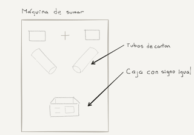
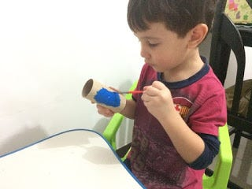
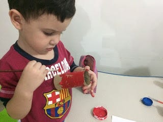
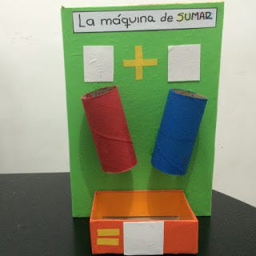

Tras una semana enfermo, con lo que parecía <a href="http://www.bbc.com/mundo/noticias/2015/06/150611_salud_virus_zika_preguntas_respuestas_kv" class="markup--anchor markup--p-anchor" data-href="http://www.bbc.com/mundo/noticias/2015/06/150611_salud_virus_zika_preguntas_respuestas_kv" rel="noopener" target="_blank" title="Qué es el virus zika, la enfermedad recién detectada en América Latina - BBC Mundo">Zica</a>, Alo se recuperó y estábamos alistando las cosas el domingo por la noche para que retomara sus clases el lunes. Revisando su agenda, resultó que tenía que llevar ese lunes un *experimento de pensamiento matemático*. Vaya y ahora qué le enviamos — fue lo que pensamos. Llevaba una semana enfermo y no habíamos revisado su morral.

No habían pasado cinco minutos, cuando Lenny ya había propuesto que hiciéramos una máquina de sumar. En nuestra búsqueda por métodos creativos para enseñar a los niños nos habíamos topado en más de una ocasión con este experimento. Es relativamente sencillo de hacer y no sé por qué no se les había ocurrido algo por el estilo en la escuela. Con sólo buscar <a href="http://lmgtfy.com/?q=maquina+sumar" class="markup--anchor markup--p-anchor" data-href="http://lmgtfy.com/?q=maquina+sumar" rel="noopener" target="_blank">en google, se encuentran miles de opciones para hacer con los niños.</a>

Enseguida comenzamos a buscar materiales entre las cosas disponibles en casa. (**Tip:** No te deshagas de cosas que pueden servir para proyectos, tubos del papel higiénico, cajas, tapas de plástico, etc.) La idea es sencilla: se pegan dos tubos de cartón a una superficie. El niño deberá escribir encima de cada tubo el número que desea sumar, de esa manera por ejemplo 3+4 significa que debe introducir 3 objetos en el primer tubo y cuatro en el segundo. Los objetos caen hasta un receptáculo ubicado en la parte inferior, el niño hace el recuento y *descubre* que la respuesta es 7. Que forma tan maravillosa de aprender. (Que las maestras se queden con sus planas.)

<figure>

</figure>

Nos pusimos a la tarea. Para el soporte utilizamos una caja de cereales. Conseguimos dos tubos de cartón de papel higiénico y pusimos a los niños a que los pintaran.

<figure>

</figure>

<figure>

</figure>

Para el receptáculo utilizamos una pequeña caja de dulces. Luego se nos ocurrió qué sería bueno que Alo pudiera escribir los números y que fuera facil de borrar para poder seguir practicando. Así que recortamos unos pedazos de una lámina de plástico que permite escribir con marcador de tinta borrable. Le pegamos la caja, las láminas, el título y … ¡*voilà*, la máquina terminada!

<figure>

</figure>

Para operarla utilizamos tapas plásticas pequeñas. Alo enseguida entendió la forma de usarla y rápidamente pudo explicar lo que estaba pasando. Le fascinó. En la escuela, la máquina fue la sensación. Se la quedaron para seguir enseñando con ella. Esto fue de nuestro agrado, pero me quedó la inquietud si más que la máquina misma, será que se preguntaron y ¿por qué no se les había ocurrido esto antes?

------------------------------------------------------------------------

*Originally published at* <a href="http://micriaturita.blogspot.com.co/2015/10/la-maquina-de-sumar.html" class="markup--anchor markup--p-anchor" data-href="http://micriaturita.blogspot.com.co/2015/10/la-maquina-de-sumar.html" rel="noopener" target="_blank"><em>micriaturita.blogspot.com.co</em></a> *on November 4, 2015.*
