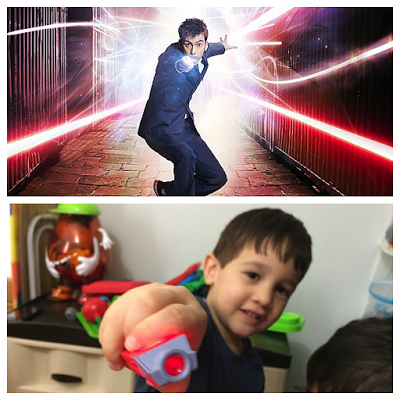
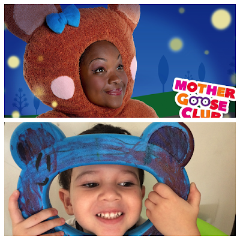

> *Los que no quieren imitar nada, no producen nada*

> ***– Salvador Dalí***

Copiar o imitar lo solemos ver con desdén. Valoramos lo original y lo auténtico, sin darnos cuenta que todos comenzamos imitando. Así construimos nuestras ideas, nuestra identidad, y nuestra manera de ver el mundo.

Nuestros hijos no son la excepción y en cuanto a las cosas o personas que imitan, no hay manera de pararles su imaginación. Igual se imaginan siendo un objeto que una persona. Incluso, poco importa el género o la edad. Nuestro deber para con ellos es permitirles y no restringirles todos estos roles que quieren experimentar.

<figure>

</figure>

Sólo poniéndonos en la piel de otros, podemos conseguir empatía con los demás y en el proceso convertirnos en auténticos seres humanos coscientes de nuestra existencia y la de los otros. Seguros de quienes somos.

En los últimos meses a Alo le encante hacerse pasar por <a href="https://es.wikipedia.org/wiki/Doctor_Who" class="markup--anchor markup--p-anchor" data-href="https://es.wikipedia.org/wiki/Doctor_Who" rel="noopener" target="_blank" title="Doctor Who - Wikipedia, la enciclopedia libre">el Doctor</a> con su destornillador sónico. Le fascina el misterio y todo lo relacionado con monstruos y extraterrestres.

<figure>

</figure>

Nico en cambio se obsesiona con musicales para niños. Le encanta <a href="http://www.mothergooseclub.com/" class="markup--anchor markup--p-anchor" data-href="http://www.mothergooseclub.com/" rel="noopener" target="_blank" title="Nursery Rhymes Videos, Songs &amp; More - Mother Goose Club">Mothergoose club</a> y se cree *Teddy Bear* (aunque él le llama *Shine*, por la canción <a href="https://www.youtube.com/watch?v=i1_UzlOOZOo" class="markup--anchor markup--p-anchor" data-href="https://www.youtube.com/watch?v=i1_UzlOOZOo" rel="noopener" target="_blank" title="Esta Lucecita Mía - Canciones Para Niños del Club de Mother Goose - YouTube"><em>There’s a light in me</em></a>). Creo que no hace falta decir que es una chica afroamericana. Impedirle que él quiera interpretar ese personaje sólo contribuye a crearle inseguridad en su identidad, pero más importante a que no pueda ponerse en el lugar de otro, independiente de su género, edad, etnia, etc.

¿Qué piensas?

------------------------------------------------------------------------

*Originally published at* <a href="http://micriaturita.blogspot.com.co/2015/12/imitando.html" class="markup--anchor markup--p-anchor" data-href="http://micriaturita.blogspot.com.co/2015/12/imitando.html" rel="noopener" target="_blank"><em>micriaturita.blogspot.com.co</em></a> *on December 8, 2015.*
