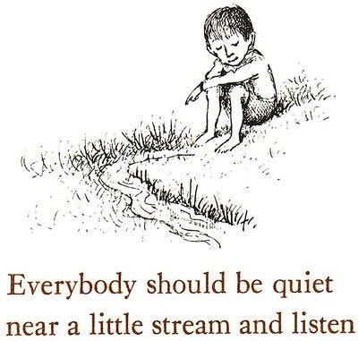

“Papi, estoy aburrido.” Es la frase que suelen usar mis hijos para manifestar que no están haciendo algo entretenido y por ende que lo están pasando mal. Incluso, usualmente está frase va acompañada de un gesto de desaliento y derrumbe físico. Literalmente se tumban al suelo. Alguna vez leí que ser adulto significa tener la capacidad para estar aburrido y poder mantenerse en pie. Sin embargo, esa actitud de mis hijos parece cada vez más latente en todos hoy en día, niños y adultos. Parece que no podemos pasar ni un minuto del día sin estar “haciendo” algo. Como que falla algo en nosotros si no estamos ocupados.

<figure>

<figcaption>Ilustración de Maurice Sendak de <a href="https://www.brainpickings.org/2013/07/25/ruth-krauss-maurice-sendak-open-house-for-butterflies/" class="markup--anchor markup--figure-anchor" data-href="https://www.brainpickings.org/2013/07/25/ruth-krauss-maurice-sendak-open-house-for-butterflies/" rel="noopener" target="_blank">Open House for Butterflies</a> por Ruth Krauss.</figcaption>
</figure>

<a href="https://www.goodreads.com/quotes/19682-all-of-humanity-s-problems-stem-from-man-s-inability-to-sit" class="markup--anchor markup--p-anchor" data-href="https://www.goodreads.com/quotes/19682-all-of-humanity-s-problems-stem-from-man-s-inability-to-sit" rel="noopener" target="_blank">Pascal dijo</a> que todos los problemas de la humanidad surgen de la incapacidad del hombre para sentarse en silencio en una habitación por sí solo. Aunque tal vez un poco exagerado, lo cierto es, que nuestros hijos (y nosotros) deben aprender a tener la capacidad para aceptarse y conocerse. Deben poder llegar a aceptar el aburrimiento como un proceso que los conduce a algo. Como escribió Adam Phillips

> *El aburrimiento es en realidad un proceso precario en el que el niño está, por así decirlo, esperando algo y buscando algo, en el que la esperanza se negocia en secreto; y en este sentido, el aburrimiento es similar a la atención flotante. En la confusión sofocada, a veces irritable de aburrimiento, el niño está alcanzando una sensación recurrente de vacío de la cual puede cristalizar su deseo real … La capacidad de aburrirse puede ser un logro de desarrollo para el niño.*

> (<a href="https://www.brainpickings.org/2014/06/19/adam-phillips-boredom/" class="markup--anchor markup--blockquote-anchor" data-href="https://www.brainpickings.org/2014/06/19/adam-phillips-boredom/" rel="noopener" target="_blank">texto original en inglés</a>, traducción propia)

Lo increíble es que en el párrafo anterior podemos reemplazar niño por adulto e igual sale; especialmente en estos tiempos de redes sociales y conectividad permanente.<a href="http://micriaturita.blogspot.com/2018/07/sobre-el-aburrimiento.html#fn:21772" class="markup--anchor markup--p-anchor" data-href="http://micriaturita.blogspot.com/2018/07/sobre-el-aburrimiento.html#fn:21772" rel="noopener" target="_blank">[1]</a>

Le tememos al aburrimiento, pero sobre todo a la soledad. No obstante, cuando comenzamos a estar cómodos con la soledad, comenzamos a encontrar lo que nos hace felices, lo que queremos y también lo que nos hace infelices. Se cristalizan nuestro anhelos verdaderos. No lo que otros quieren que hagamos, sino lo que nosotros auténticamente queremos -y lo que no también-.

Constantemente estamos buscando entretenimiento y todo lo que nos saca de ese estado de aburrimiento mantiene a nuestras mentes “ocupadas” y eso no es saludable. Esto no significa que tenemos que obligar a nuestros hijos a aburrirse de muerte, sino más bien a mostrarles que nosotros mismos estamos en la capacidad de estar tranquilos, sin dispositivos, y dispuestos a pensar por un rato qué es lo que queremos hacer. El éxito en la vida, probablemente esté del lado de quienes se detienen un rato en el día, sin distracciones, a contemplar el silencio y descubrir un nuevo mundo ante sus ojos. Démosle ese espacio a nuestro hijos, sólo así podrán ellos mismos tomar sus decisiones sobre qué quieren en la vida más adelante.

------------------------------------------------------------------------

*Originally published at* <a href="http://micriaturita.blogspot.com/2018/07/sobre-el-aburrimiento.html" class="markup--anchor markup--p-anchor" data-href="http://micriaturita.blogspot.com/2018/07/sobre-el-aburrimiento.html" rel="noopener" target="_blank"><em>micriaturita.blogspot.com</em></a> *on July 16, 2018.*
