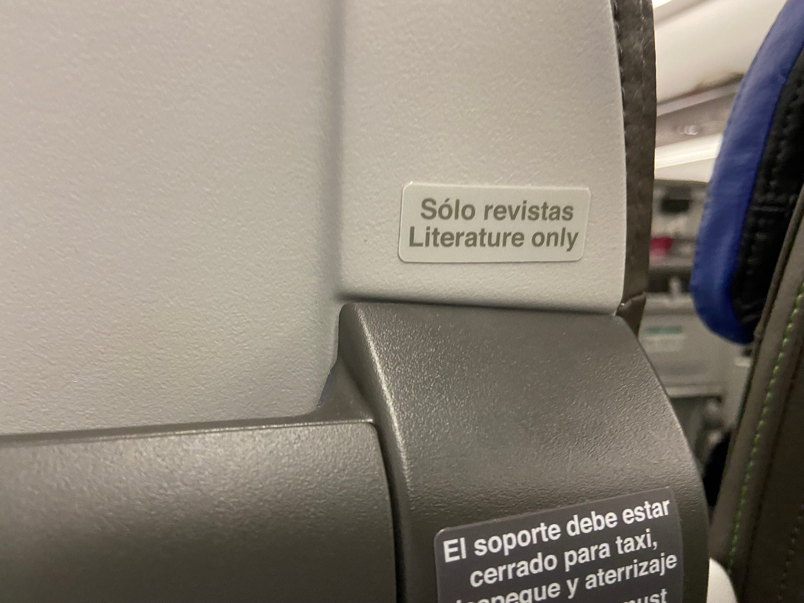

**Taxi y literatura**

<figure>

<figcaption>Cuando hasta el avión te invita a sólo leer literatura.</figcaption>
</figure>

A raíz del lanzamiento de la <a href="https://www.utb.edu.co/utb-lanza-la-octava-edicion-de-su-coleccion-semilla-libros-para-incentivar-la-lectura/#:~:text=La%208va%20edici%C3%B3n%20de%20esta,la%20p%C3%B3cima%20y%20el%20tesoro%E2%80%9D." class="markup--anchor markup--p-anchor" data-href="https://www.utb.edu.co/utb-lanza-la-octava-edicion-de-su-coleccion-semilla-libros-para-incentivar-la-lectura/#:~:text=La%208va%20edici%C3%B3n%20de%20esta,la%20p%C3%B3cima%20y%20el%20tesoro%E2%80%9D." rel="noopener" target="_blank">octava edición de la <em>Colección Semilla</em> en la Universidad Tecnológica de Bolívar</a>, me pareció oportuno compartir esta entrada relacionada con la precisión en el lenguaje, especialmente en la traducción.

No hay que ser un experto en lingüística para darse cuenta de que la traducción del español al inglés de “Sólo revistas” no es *“literature only”*, y que la del inglés al español *“Device holder must be stored for taxi, take off and landing”* no es exactamente “El soporte debe estar cerrado para taxi, despegue y aterrizaje”. En el primer caso, la traducción correcta sería *“magazines only”*. En cambio, en el segundo, la palabra *“taxi”* en inglés tiene dos connotaciones: como vehículo de transporte público o como verbo que describe la acción de rodar por la pista de aterrizaje, lo que en América Latina llamamos “carretear”.

Estas dos traducciones las encontré en un vuelo de Latam que abordé en días pasados. Podría pensarse que el mensaje es comprensible o que el contexto basta para aclarar el significado, pero hay algo más profundo aquí: un aparente desdén por la precisión del lenguaje.

La precisión del lenguaje es crucial, especialmente en la industria aeronáutica, donde la seguridad depende de una comunicación clara y sin ambigüedades. Por esta razón, se desarrolló el <a href="https://simple.wikipedia.org/wiki/Simplified_English" class="markup--anchor markup--p-anchor" data-href="https://simple.wikipedia.org/wiki/Simplified_English" rel="noopener" target="_blank">inglés simplificado</a>, una versión controlada del idioma destinada a ayudar a los ingenieros a crear manuales técnicos que puedan ser comprendidos por personas de todo el mundo, reduciendo así el riesgo de malentendidos.

El inglés simplificado comenzó a desarrollarse en la década de 1970, y su evolución continúa hoy en día. La AECMA, la “Asociación Europea de Fabricantes Aeroespaciales”, inició este trabajo, y la ASD, la “Asociación de Industrias Aeroespaciales y de Defensa de Europa”, ha seguido manteniéndolo a través de su grupo de mantenimiento STEMG, encargado de revisar y actualizar el estándar conocido como ASD-STE100.

Veamos un ejemplo sobre el uso del verbo *close* en inglés simplificado. Las reglas indican que sólo se deben usar palabras aprobadas por el estándar y en las formas permitidas, para reducir la posibilidad de malentendidos. Por ejemplo, se permite el uso del verbo *close* en contextos como “Do not close the door” (No cierres la puerta) y del adjetivo *closed* en su forma de “no abierto”, como en “The door is closed” (La puerta está cerrada). Sin embargo, no se permite el uso del adjetivo *close* en el sentido de “cercano”, para lo cual se debe utilizar la palabra *near*. Así, en lugar de decir “Do not go close to the door” (No te acerques a la puerta), el inglés simplificado prefiere “Do not go near the door” (No te acerques a la puerta). De esta forma, el lector puede estar seguro de si las instrucciones se refieren a cerrar la puerta o a mantenerse alejado de ella.

Esto me lleva a preguntarme sobre el entrenamiento que reciben quienes producen estos avisos y, más importante aún, qué tanto se adhieren a las buenas prácticas de redacción en <a href="https://www.amazon.com/-/es/Ilaria-Gobbi-ebook/dp/B07NQKD8ZP" class="markup--anchor markup--p-anchor" data-href="https://www.amazon.com/-/es/Ilaria-Gobbi-ebook/dp/B07NQKD8ZP" rel="noopener" target="_blank">español para documentos técnicos</a>. ¿Estamos aplicando estos estándares en el mundo hispanohablante? La claridad y precisión en la redacción de documentos técnicos no es sólo una cuestión de traducción fiel, sino de garantizar que el mensaje sea entendido de la misma manera por todos. La necesidad de un *español técnico simplificado* se hace evidente en estos pequeños errores que, aunque no representan un peligro inmediato, evidencian una falta de cuidado en la comunicación. Si en el ámbito aeronáutico se siguen estas reglas estrictas para asegurar la seguridad, ¿por qué no adoptar un enfoque similar en otros sectores técnicos de habla hispana?

En fin, si de taxis y literatura se trata, parece que estos traductores se quedaron “carreteando” en la pista de aterrizaje de las palabras.
