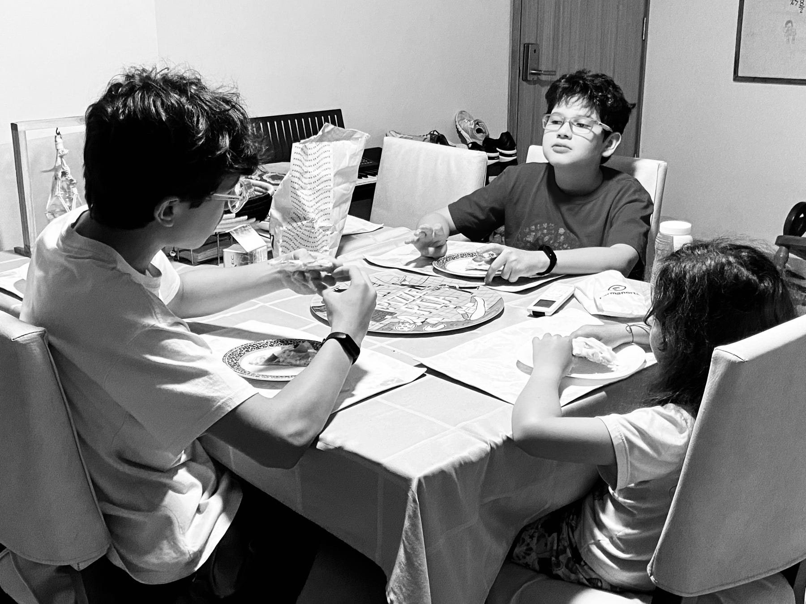

<figure>

</figure>

Más implacable que la contabilidad fiscal es la que llevan mis hijos cada vez que hay pizza: una contabilidad minuciosa, casi ritual, de cuántos pedazos ha comido cada quien. Para que nadie, *nadie*, coma más que el otro.

Es una angustia que avanza bocado a bocado, con el rabillo del ojo en el centro de la mesa, contando lo suyo y lo ajeno. Son tres hermanos, de edades distintas pero igual de voraces si hay queso derretido de por medio. Es una coreografía de miradas rápidas, gestos comedidos y manos que van y vienen con urgencia. Un disfrute tenso, casi contenido.

– ¿Queda más en el horno? —pregunta uno, con esperanza.

– Sí —respondo.

Entonces hacen las cuentas. Calculan. Proyectan.

En cuanto llega la siguiente pizza, se lanzan sobre ella con una mezcla de frenesí y civilidad, pactando el reparto con la solemnidad de una tregua. Saben que esta partida sólo puede terminar en tablas, pero igual la juegan como si algo estuviera en juego.

La tercera ronda los encuentra algo fatigados, pero aún animados por la ilusión de coronarse campeones de la noche. El que más trozos conquiste será, por unas horas, el rey. Pero pronto la realidad se impone: hay quien se llena más el ojo que la tripa… y se rinde.

Y entonces ocurre. La escena se repite como una estampita familiar: los dos restantes observan la bandeja. Tres pedazos. Dos jugadores.

– Uno y uno —dicen los ojos.

– Y el último… ya veremos.

Al final, con un solo trozo en el centro, aparece quien recuerda —con la sabiduría de quien ya cruzó esa línea – que la última vez no pudo dormir del dolor. Así que se echa hacia atrás, como un caballero de otra época.

El hermano menor, atento y suspicaz, se lanza sobre la victoria como si fuera una bandera. Pero una hora más tarde pide manzanilla con la dignidad rota y la barriga rebelde. La victoria fue apenas una apariencia.

Pasarán los días, y volverán al ruedo. Él habrá olvidado las consecuencias.

En el centro de la mesa, como un sol ya apagado, quedó una pequeña mancha de queso. Nadie la limpió. Ninguno la miró. Pero ahí quedó: como testigo silencioso del juego antiguo de ganar y perder entre hermanos. Como quedan las cosas que no se dicen… pero que, de algún modo, se heredan.
