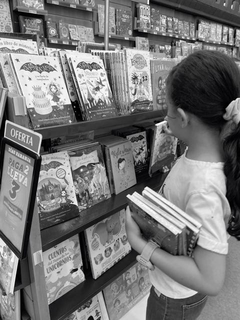

<figure>

</figure>

Eran las cuatro y cincuenta y uno de la tarde. Una de esas tardes en las que, en otro momento, nos habríamos quedado en casa. El cielo estaba nublado y el aire tenía ese olor espeso de cuando parece que va a llover, pero apenas caen tres gotas dispersas. Sin embargo, me convenciste y salimos. Aquí estamos, en la librería que ya no es del todo una librería. Los libros ocupan apenas un rincón; lo demás es una miscelánea de artículos. Es una mezcla agridulce: por un lado, eso es lo que la mantiene abierta; por otro, es imposible no sentir que los libros han perdido terreno, que el espacio que deberían tener en nuestras vidas se va encogiendo.

Y ahí estás tú, escogiendo un libro de *Isadora Moon*. Hace solo unas semanas te compré el primero, y ahora estás emocionada, entrando a ese mundo imaginario que ya sientes tuyo, donde te gusta estar, al que regresas con alegría. Esa niña, mitad hada y mitad vampiro, te ha conquistado. Y tú, con tu mezcla de Caribe y montaña, también pareces sacada de un cuento. Quizá por eso conectas tan bien con Isadora. Porque uno se da cuenta, al leer, de que rara vez está solo. Hay otros que han sentido lo que uno siente, que han pasado por donde uno pasa. Solo que quienes no leen, tal vez nunca lo descubren. <a href="https://www.goodreads.com/quotes/408441-a-reader-lives-a-thousand-lives-before-he-dies-said" class="markup--anchor markup--p-anchor" data-href="https://www.goodreads.com/quotes/408441-a-reader-lives-a-thousand-lives-before-he-dies-said" rel="noopener" target="_blank">Como dijo Jojen: “Un lector vive mil vidas antes de morir. El que nunca lee, vive solo una.”</a>

Mientras estábamos allí, pasó una mamá insistiendo, casi suplicando, que su hija escogiera un libro. La escena me conmovió, quizá porque me vi reflejado. Yo también estuve ahí: deseando que tú encontraras en la lectura algo más que una obligación. Y no fue fácil. Pero no me rendí. Lo que más me ayudó fue algo tan simple como constante: dejar que me vieras leer, hacer de mis libros un lugar al que podías entrar cuando quisieras, sin presión. Porque al final, los niños no aprenden por mandato, sino por contagio. Y sólo se contagian de lo que ven de verdad. Los niños huelen la autenticidad: sólo siguen ejemplos que transpiran convicción.

Nos decidimos por uno, pero justo aparece la vendedora y nos cuenta que los de Penguin Random House están en promoción: tres por dos. Te emocionas. Quieres llevarlos todos. Pero no, solo tres. Escoge bien. Cuando los termines, seguimos con la serie. Y tú aceptas, feliz. Y yo, al verte, aún más.

Así, en una tarde cualquiera de junio, con el calor pegado a la piel y la humedad que hace que todo parezca detenerse, quedará este instante. Un recuerdo que tal vez se mezcle con muchos otros, pero que en su fondo guarda lo esencial: lo que todo padre quiere, sentirse cerca, ser parte del mundo de su hija. Porque la vida, al final, es eso. Y donde estés tú, estará mi corazón.
