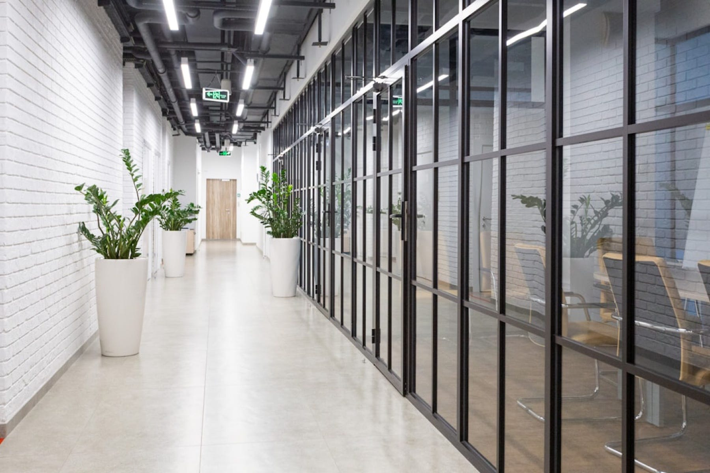

<figure>

<figcaption>Photo by Petr Magera on <a href="https://unsplash.com/?utm_source=medium&amp;utm_medium=referral" class="markup--anchor markup--figure-anchor" data-href="https://unsplash.com/?utm_source=medium&amp;utm_medium=referral" rel="noopener" target="_blank">Unsplash</a></figcaption>
</figure>

En estos tiempos de reuniones remotas, virtuales y telepáticas, el encuentro fugaz y no estructurado del pasillo se vuelve un sorbo de agua fresca bajo el sol del mediodía: breve, inesperado, pero capaz de saciar la sed —sobre todo la del espíritu.

Vas caminando, cruzas una mirada, y ya sabes que lo mínimo será un saludo. Pero a veces, el saludo se estira, se enrosca, se convierte en recordatorio, y ese en pequeña discusión. Se avanza la causa, sí, pero más que nada se desnuda el carácter de quien, en otros espacios, vestiría formalidad como escudo.

Sostienes la puerta para una, dos, hasta tres personas. Te quedas allí, atravesado en el pasillo, interrumpiendo el flujo como un peñasco que obliga al río a bordearlo. Alguien pasa, se agacha, pide excusas. Pero la conversación sigue.

No es chisme —si lo fuera, sería más secreto — . Es el calor nuestro, lo festivo que llevamos en el habla. Es prueba de que el aislamiento virtual no coopera con la camaradería, esa que se cuece lento, al fuego de los encuentros espontáneos.

Y cuando ya la mano se tensa de sostener la puerta, y la razón por la que saliste de la oficina se evapora, apenas comienza la aventura de recuperar la senda, la idea, el motivo. Siempre se encuentra, claro, pero los cinco minutos se han vuelto quince.

Es en esos momentos —tan pequeños como vitales — donde un lugar cobra alma, donde la visión se comparte sin necesidad de agenda, y donde lo invisible del trabajo se hace visible en la complicidad de un pasillo cualquiera.
