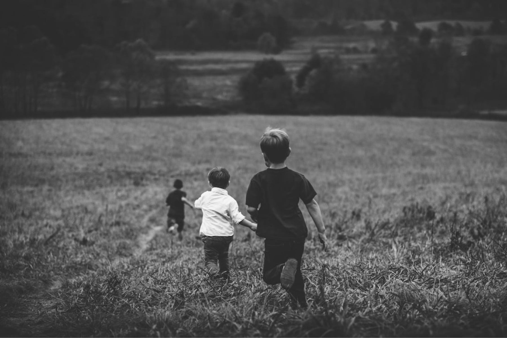

<figure>

<figcaption>Photo by <a href="http://linkedin.com/in/jordanwhitt" class="markup--anchor markup--figure-anchor" data-href="http://linkedin.com/in/jordanwhitt" rel="noopener" target="_blank">Jordan Whitt</a> on <a href="https://unsplash.com/?utm_source=medium&amp;utm_medium=referral" class="markup--anchor markup--figure-anchor" data-href="https://unsplash.com/?utm_source=medium&amp;utm_medium=referral" rel="noopener" target="_blank">Unsplash</a></figcaption>
</figure>

Hay cosas en la vida que parecen cada vez más raras, casi de otro tiempo. En estos días de hijos únicos o hijos perrunos, de familias dispersas y agendas saturadas, pocos se dan el lujo de experimentarlas. Vacaciones con primos, por ejemplo.

Son las diez y cincuenta y cinco de la noche. Es domingo, pero mañana es lunes festivo y estamos en las vacaciones de mitad de año. Qué alegría; no hay que levantarse temprano. En la puerta de llegadas, dos niños se arremolinan cerca del celular de su hermano mayor. Hace diez minutos, la tía escribió al grupo familiar que ya habían aterrizado. Pero aún no han salido.

– Deben estar esperando la maleta —dice el mayor.

– Claro —responde el otro – . Si vienen por quince días, deben haber traído de todo. Esa maleta debe pesar un montón.

La menor, con la mirada fija en el pasillo, interviene con toda la seriedad del mundo:

– Le pedí a mi prima que trajera toda la ropa que tenemos igual, incluyendo las pijamas, para que todos sepan que somos primas.

Es una conversación que vibra de anhelo, que reconozco con una mezcla dulce de ternura y vértigo. Porque la viví muchas veces. Al oírlos, me descubro reflejado, como si aquel niño que fui estuviera otra vez en esa sala, con el corazón dando brincos al compás de las maletas que no aparecen. Recuerdo que, por entonces, la zona de llegadas estaba a la vista, apenas cerrada por unas barras metálicas. Pero a mis seis o siete años, bastaba con escabullirme entre ellas para adelantarme al saludo, para ser el primero en abrazar al recién llegado. Tal vez por eso ahora, verlos allí esperando, me conmueve tanto: porque en ese pequeño impulso —el deseo de cruzar antes que nadie – sigue latiendo intacta la misma emoción.

Pasan dos minutos más. Se asoma la tía por el corredor largo en forma de L que no deja ver bien quién viene. Pero en un santiamén, aparecen los primos. La ansiedad se transforma en estampida. La fricción de las suelas contra el piso apenas alcanza para contener la fuerza con que se lanzan a ese pequeño escuadrón que bien podría haber salido de un cuento de García Márquez: tan esperado como irreal, tan festivo como urgente.

Han pasado dos años desde la última visita. Pero si algo dejó la pandemia, es que los primos —y en menor medida, los tíos – se mantuvieron en contacto. Se saben los juegos del momento, las películas que han visto, y hasta las notas del colegio. Porque no hay vanidad más sabrosa que regodearse con una buena nota frente al primo que aún no sabe dividir con decimales.

Cuando los abrazos y las sonrisas se evaporan y quedan suspendidos en el aire como la humedad tibia de esta noche caribeña, procedemos a saludarnos formalmente. “¿Cómo están?”, “¿Cómo fue el vuelo?” son las primeras frases verdaderas. Lo anterior fue un simulacro, un idioma hecho de saltos, risas y manos que no saben estarse quietas.

Entre lo evidente: ayudar con el equipaje, cargar la parafernalia del viaje. Pero la ilusión sigue viva. Mientras caminamos hacia el carro, ya se tejen los planes: mañana piscina, después pizza. Las camas se distribuyen como si fuera un juego de estrategia: quién duerme con quién, quién se queda con la cama auxiliar, quién en la colchoneta.

En la emoción por este reencuentro, olvidaron mil cosas que querían tener listas. Pero no importa. Las vacaciones son largas, y lo importante no es el orden de las piezas sino el calor del tablero.

No hemos cruzado la calle hacia el parqueadero y ya escucho, sin intervenir, una lista de ideas para mañana. No quiero cortar el impulso. Y la verdad, no es un mal plan. Más que reconfortante, es necesario. Una pizza entre cinco primos es una batalla épica donde los sobrevivientes no solo viven para contar la historia, sino que quedan investidos como árbitros vitalicios de disputas por <a href="https://medium.com/@agmarrugo/el-%C3%BAltimo-trozo-352f95ef7a0f" class="markup--anchor markup--p-anchor" data-href="https://medium.com/@agmarrugo/el-%C3%BAltimo-trozo-352f95ef7a0f" target="_blank">el último trozo</a>, como si llevaran en las manos la balanza de la justicia de los días felices.

Y así comienzan dos semanas con primos a bordo. Con desorden en el mismo desayuno, con carcajadas que se derraman por el pasillo, con una promesa no dicha de que cada minuto será contado.

Porque tener primos, de esos que te esperan al pie del aeropuerto como si llegaran de Narnia, es uno de los privilegios más grandes que nos da la vida. No hay foto que lo capture, ni calendario que lo anticipe. Pero lo recordaremos. Como se recuerdan las noches en que bastaba una linterna y una historia para sentir que el mundo era nuestro, los tonos anaranjados de ciertas tardes, o el olor de una pijama compartida que dice sin decirlo: somos familia.
