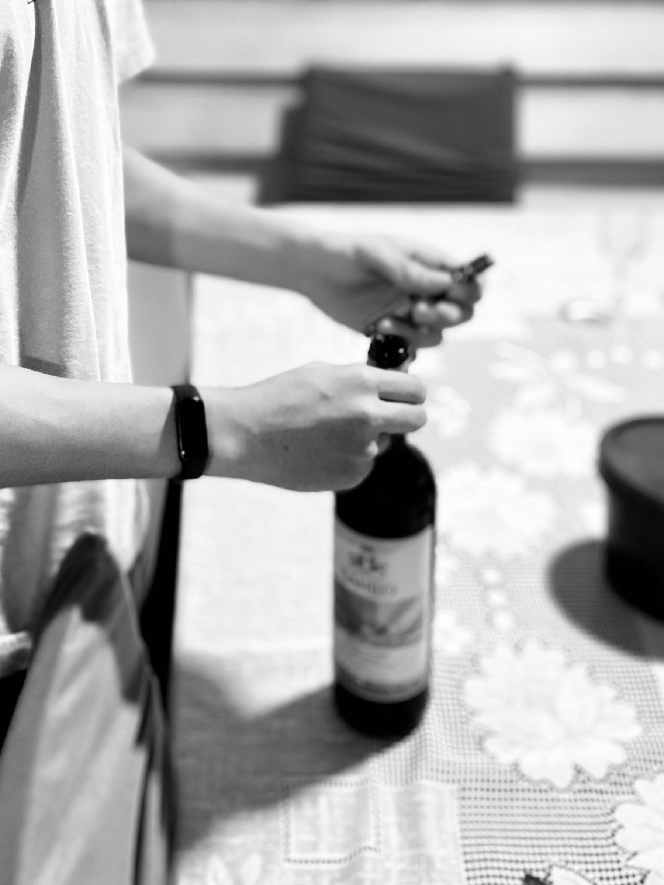

<figure>

</figure>

Era un domingo de junio, de esos que se confunden y se funden en la memoria, un día del padre sin estridencias pero con su propio fulgor doméstico, allá en la casa de la abuela.

Te sentías intrigado por el vino que llevamos: un Primitivo Borgo San Leo de Salento. En el último año te atraen estas cosas —querer mirarte en el espejo de los adultos es parte del viaje – y a mí me alegra acompañarte cuando la duda se asoma.

Tomaste la botella, la observaste con cuidado, posando la mirada sobre la cápsula, esa lámina que abraza la parte superior como un pequeño sombrero de fiesta, luminoso y prometedor. Te pedí que la abrieras: que buscaras el sacacorchos y emprendieras por ti mismo la mini-odisea de descorchar.

La abuela te alcanzó un sacacorchos de dos tiempos; pero tú no lo sabías. Primero intentaste clavarlo sin quitar la cápsula y te señalé, con media sonrisa, que el corcho ni siquiera era visible.

Te ayudé a rasgarla con la punta de la espiral y tú, muy afinado, quisiste terminar lo que yo había comenzado. Pero como yo soy diestro y tú zurdo, lo intentaste en sentido contrario. La cápsula pareció resistirse a esa confusión de giros, como si notara que algo no encajaba del todo. Aun así, lo resolviste a tu modo, encontraste el ángulo y la abriste.

Sin pensarlo mucho, saltaste directo al corcho, clavando la espiral con decisión, pero también con algo de apuro. Entró torcida, como suelen salir las cosas cuando uno se adelanta al ritmo. Pero corregiste el rumbo con paciencia —esa que a veces sorprende incluso a ti mismo – y seguiste adelante.

Hiciste una pausa, respiraste hondo. Intentaste tirar y el corcho no cedió ni un milímetro. Te recordé que no era cuestión de fuerza, sino de saber usar la herramienta. Te mostré la palanca y repetí: apoya bien el punto de apoyo. A la primera no, a la segunda casi, y a la tercera venciste: un solo impulso limpio, un ¡pop! suave y triunfal. Tus ojos se abrieron como cuando uno descubre un truco que ya nunca olvida. El corcho resbaló un instante, lo atrapaste al vuelo. Esa menuda hazaña se quedará trenzada a tu adolescencia, confundida con tantas otras primeras veces.

Acercaste la botella a tu nariz; jugaron allí los aromas frutales, cálidos y oscuros como fruta madura enjaulada en su cáscara, lista para soltar su secreto. Te enseñé a servir: no como el agua que salpica ni como la gaseosa que se desborda, sino siguiendo un rito. Se sostiene por el fondo, nunca por el cuello; el pulgar se afirma debajo, y se vierte sin apuro, reconociendo al otro en cada copa.

Así, en aquel domingo de junio, lo aparentemente corriente se volvió semilla de un recuerdo. Ese es el tesoro de un padre: saber que lo extraordinario se cuela por las rendijas de lo simple, y que en los pequeños rituales —aunque parezcan minúsculos – se trazan los mapas que un día les servirán para navegar la vida.
