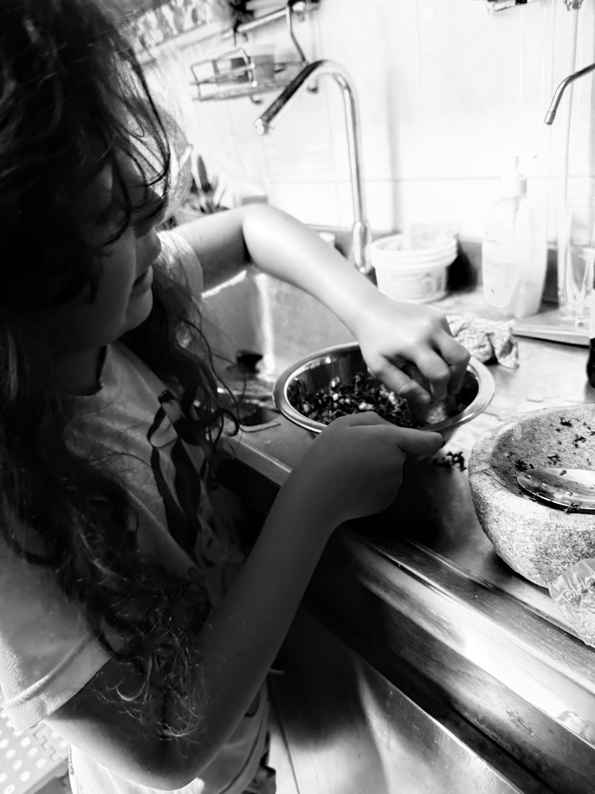

<figure>

</figure>

El aroma que se escapa del perejil macerado en el mortero —que si hablara, diría que está tumbado al sol en una pradera húmeda, entre pasto recién cortado y tierra mojada — es una de esas sensaciones que querías recordar.

La cadencia del cuchillo golpeando la tabla, rebanando finos trozos de ajo, nos envuelve en un aire que huele a Italia, a un rincón mediterráneo donde el tiempo se derrite entre aceite y albahaca. Nos recuerda a tantas noches en casa, haciendo pizza o pasta. Pero no, hoy no. Hoy me pediste ir al cono sur.

Seguimos con la cebolla, que se resiste un poco, y nos arranca una lágrima. Aun así, avanzamos, dúo afinado en este concierto a dos manos que hemos ido ensayando sin darnos cuenta.

Volvemos al mortero. Seguimos machacando, amalgamando este puñado de elementos que no son solo ingredientes, sino pequeñas notas de una sinfonía aromática que ya empieza a levantar el telón. Nos acercamos. Aún no, pero ya casi. Tú tomas las riendas y te apoderas del mortero. Es tu bastión. Nadie te lo quita.

Una cucharada de orégano cae y declara: esto se ha puesto serio. Soy el hermano mayor en esta danza de sabores que se entrelazan sin apuro, como si el tiempo también cocinara.

El jugo de limón se desliza por el exprimidor recordándonos que la acidez también es tierra, también es verano. Y para que ese verano no se escape, lo atamos con un buen chorro de vinagre de vino, que avisa: esto ya no es un juego de niños.

No te contienes. Pruebas una vez, y otra. Arrugas la cara, te contienes… y luego estallas en una sonrisa. Un ojo medio cerrado te delata: está riquísimo, dices, y yo solo asiento.

“Falta el pimentón”, me dices. “Pícalo tú, yo sigo aquí.” El cuchillo vuelve a bailar. Salen trozos rojos y verdes, que al tocar la tabla desprenden moléculas que se agitan, saltan, se estrellan contra el aire espeso de esta mañana húmeda, hasta colarse en nuestras fosas nasales como si la primavera entera hubiera decidido quedarse a vivir aquí.

Caen en el mortero, uno a uno, sumergiéndose en esa mezcla que tú no dejas de mover con la pasión de quien sabe que un gesto puede ser un lenguaje.

Ya solo queda salpimentar. Porque en ese punto el balance no es un accidente: es una decisión. Y la sal y la pimienta lo saben. Este es el cierre técnico, la recta final.

Entonces me miras: “¿Y el aceite de oliva?” ¿Cuál?, pregunto. “¿El de cocinar o el virgen extra?” —“El que me encanta”, dices, casi con risa. Por supuesto: el virgen extra. El que corona. El que da abrigo y redondea esta sinfonía que tú y yo hemos cocinado en una mañana de julio.

Porque sí, podríamos haber comprado el chimichurri de siempre, el de la carnicería, listo, empacado y exacto. Pero este —el nuestro — es otra cosa. Sabe mejor, sí, pero además lleva historia, lleva huella. Y ese perfume lento, de lo que se hace sin prisa y entre dos, no lo venden en ninguna tienda.
