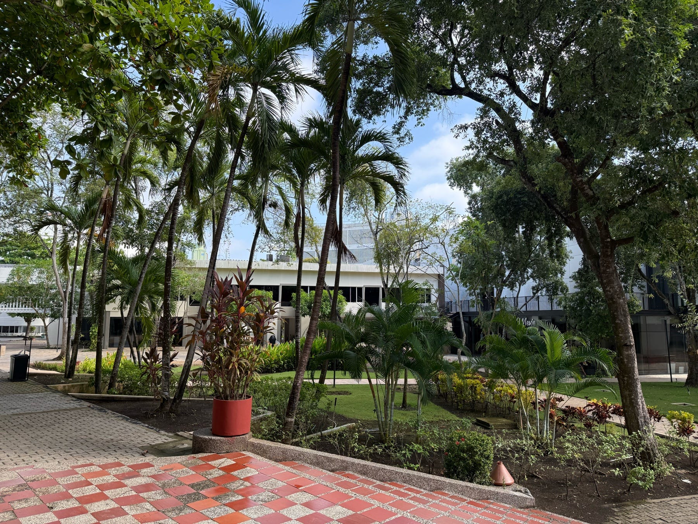

<figure>

</figure>

Una mañana de julio entrando al campus, cuando el cielo apenas comienza a desteñirse y los pasillos, aún vacíos, parecen contener el aliento. Es esa franja de tiempo entre el cierre de los cursos de verano y el regreso de los estudiantes – ese intervalo breve en el que la universidad se escucha a sí misma.

El aire, húmedo y tibio, se cuela entre los edificios con la calma de quien no tiene prisa. Los periquitos chichirrean de árbol en árbol como si anunciaran en clave la buena nueva del día. Sus cantos entreverados forman una sinfonía leve, que no busca atención, pero que se deja notar si uno se detiene.

Una brisa tenue serpentea entre los muros y los árboles. No refresca del todo, pero carga ese olor espeso del agua que viene, como si la mañana ya supiera que, pasado el mediodía, una tormenta breve tocará tierra.

A lo lejos, el arrullo metálico del jardinero barriendo hojas se mezcla con el crujir de las ramas secas, como si el suelo, al despertarse, estirara sus huesos. Ese sonido invita a sentarse bajo los paragüitas y ensayar el deporte nacional de ver pasar la vida, de narrarla en voz baja con quien se siente cerca. No es chisme. Es crónica espontánea, es oralidad en reposo.

Los insectos no faltan; cigarras que insisten con su zumbido telúrico, grillos que tallan el aire con sus patas, pequeños zancudos orbitando los bordes del día. Es la música discreta de nuestro bosque que despierta con la lluvia, una vibración constante, apenas audible, pero firme como el pulso de una tierra que revive con cada aguacero.

Y entonces el canto súbito de un sinsonte, claro y preciso, se asoma entre las ramas. No interrumpe. Rompe apenas el velo del silencio para decir que está ahí, como quien entra a un salón vacío y saluda sin alzar la voz. Su melodía no busca protagonismo. Invita. Le da forma al instante.

En esos segundos que me toma caminar desde Maloka hasta el edificio de aulas 1, me cruzo con decenas de formas de vida que no se exhiben, pero están. La biodiversidad no siempre grita, a veces susurra. Y para oírla hay que disponer el cuerpo, como diría Goethe, no sólo al oído, sino también al entendimiento – porque a veces es la mente la que traduce aquello que el cuerpo percibe pero no logra descifrar del todo.

Así, esta mañana sin estudiantes se revela como una coreografía invisible de lo vivo. El campus calla, pero no está quieto. Está a la espera. Porque incluso en el silencio, nuestro campus respira.
