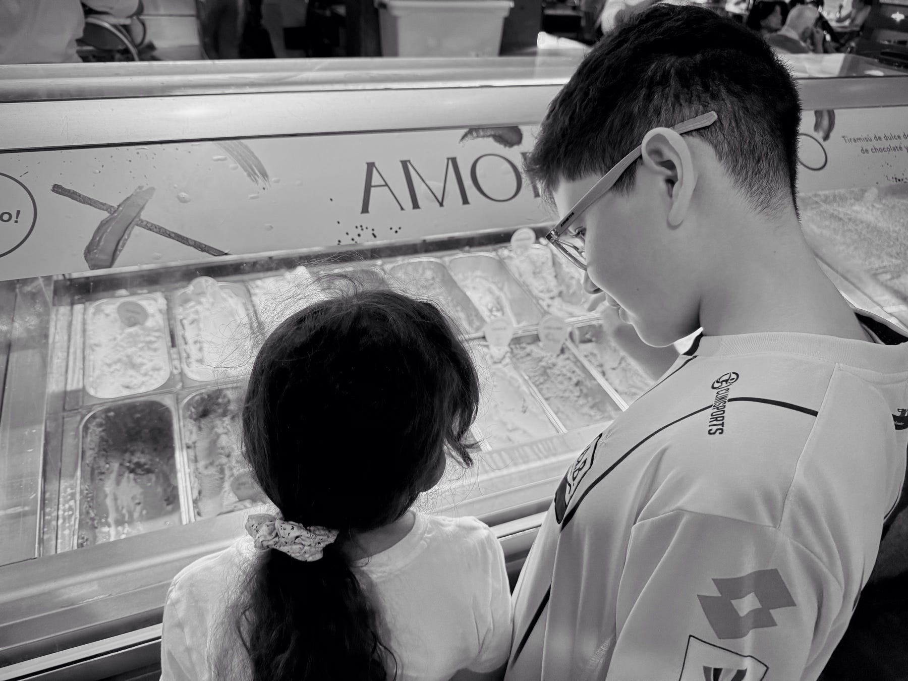

<figure>

</figure>

Venir una tarde de domingo, como hoy – lluviosa y húmeda – a Crepes, es una escena que bien conocemos: predecible, agradable y, sobre todo, familiar. Entre la multitud de sabores, los nuevos lanzamientos, los clásicos de vainilla, chocolate y fresa… pero no, hay muchos más: brownie, crocante, pistacho, frutos rojos. Y aun así, ese carrusel de tentaciones abre la pregunta de si arriesgarnos, de si probar algo distinto. Pero en la cercanía de lo conocido, de lo seguro, en la memoria del sabor que evoca recuerdos, está el mismo sabor de siempre: choco Rochelle.

Esa pequeña explosión de tiras de chocolate estriado, en medio de cristales de hielo, azúcar y aire, es una fiesta en el paladar – y un regreso a lo reconfortante, a lo conocido. Como aquel boli de kola con leche que la abuela servía sin falta los sábados.

Ante la imposibilidad de escoger, la certeza en medio de la incertidumbre es lo que ofrece regresar a lo conocido. Cuando la ansiedad abunda, lo conocido se vuelve un resguardo, una bahía de tranquilidad donde el disfrute es pleno y la posibilidad de una mala experiencia, limitada.

Así, en una tarde como esta, no pedimos un helado, pedimos una bola de certeza servida en copa de nostalgia, porque en la vida hay que abrazar esas tardes lluviosas de domingo para volver a donde uno fue feliz, porque ahí está lo que reconforta.

Y al final, en medio de la multitud de sabores, el conocido – por simple que parezca – es el que más nos satisface.
