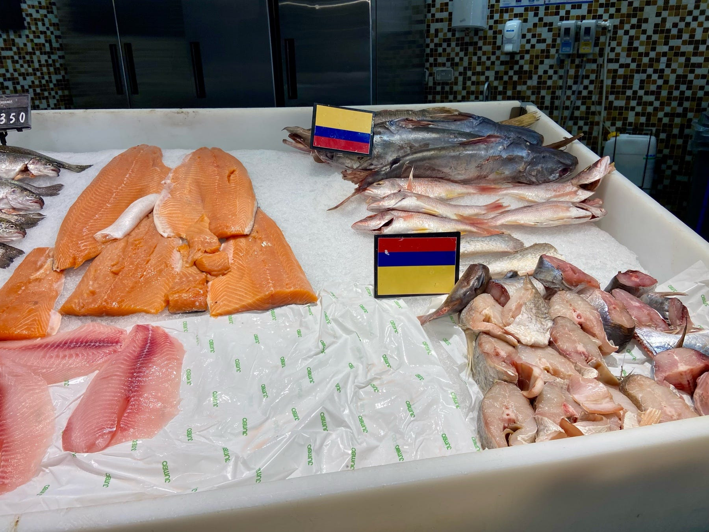

<figure>

</figure>

Es un día de esos muy particulares: un siete de agosto, festivo por el cumpleaños del abuelo y, de paso, por eso de la Batalla de Boyacá —comenta Elena riéndose de oreja a oreja. Un jueves festivo que rompe la dinámica de la semana y lo deja a uno con un miércoles que parece viernes, un jueves que parece domingo, y un viernes de resaca que no parece nada, realmente.

Estamos aquí, en el Jumbo, en la pescadería, aprovechando el jueves de pescado, al que normalmente no alcanzamos a venir por los compromisos que la semana regular exige. La atención es lenta, aunque no hay mucha gente. La chica que atiende parece nueva en el puesto. Por cada pregunta nuestra le grita al del mostrador de carnes para que le dé el código.

Primero las sardinas, que se ven espectaculares, pero nos entiende que queremos tilapia. La vemos manipulando y preguntando por el código de la tilapia, hasta que le hacemos caer en cuenta que eran sardinas lo que queríamos.

– ¿Cuántas? —pregunta.

– Todas —respondemos al unísono.

Viendo que esta tarea tomará un buen rato y ya son las doce del día —y que los niños en casa comenzarán a ponerse inquietos por el almuerzo – , le digo a mi esposa que iré adelantando con las verduras para la ensalada.

Un día como hoy, con esa ruptura en medio de la semana, mercar se vuelve algo más exótico. No es el mercado de la lista ni de los víveres que faltan. Es el mercado de lo que hay fresco para hacer enseguida. Es casi ese anhelo de comer lo que esté más fresco lo que invita.

Camino por los pasillos de las verduras. Al ingresar al supermercado habíamos hablado de hacer pescado con una salsa de maracuyá. Estuvimos de acuerdo, hasta que se me ocurrió otra cosa. El aroma de las hierbas aromáticas me invitó: está decidido, será pescado con adobo de tomillo fresco, ajo, limón y aceite de oliva. Esa mezcla, fresca, aromática y tan mediterránea, me transporta a los años que vivimos en Catalunya.

Recojo los ingredientes y decido rápidamente que lo acompañaremos con una ensalada fresca: lechuga crespa, un pepino suculento y unos tomates cebra, para variar y darle un toque de color muy particular.

Cuando regreso, mi esposa aún sigue frente al mostrador de la pescadería. Se nota que la chica se toma su tiempo para atender —menos mal es un día lento.

Al costado de nuestro carro de compras, una señora de unos sesenta y tantos conversa plácidamente con mi esposa. De cara amable y mirada sincera, practica el deporte nacional de comentar la vida en la fila del supermercado. Una costumbre que se va perdiendo entre jóvenes adultos inmersos en sus cuadritos tecnológicos —ventanas a otros lugares.

– Un día como hoy, yo preparo un mote de queso. Está súper rápido y no me cuesta nada prepararlo —nos dice con una sonrisa diáfana, cerrando los ojos como dos gotas de agua – . Pongo a cocinar el ñame solo con sal, de espina, por supuesto. Aparte hago un hogao con cebolla, tomate, ajo y cebolla larga.

Mi esposa comenta que también le añaden berenjena.

Ella se sobresalta y explica:

– Eso es en Sucre, donde le adicionan berenjena y bledo. Pero aquí lo hacemos así, a lo tradicional —continúa su explicación – .

Cuando está el ñame, le adiciono el hogao, suero costeño y la mitad del queso. No lo echo todo porque se deshace, y además, cuando se sirve, hay quien se acapara todo el queso. Así que cuando voy a servir, añado el queso a cada plato, para que a todos les toque suficiente.

Y eso, ese es el almuerzo para tres que somos en la casa en un día festivo como hoy —dice sonriendo, justo cuando le llega el turno para pedir.

Nos despedimos como quienes se conocen de toda la vida, sin saber si volveremos a vernos. Pero sabiendo que ese intercambio es tan valioso como el sentido mismo de la vida, esa metáfora del encuentro. Porque si algo parece suceder en estos tiempos de hiperconectividad es que esa conexión humana básica y espontánea la estamos perdiendo.

Ojalá y estos días un poco raros —que rompen la rutina – sigan siendo la excusa para salir y conversar con un desconocido con quien compartimos tanto, que se nos olvida que no nos conocemos.

Recuerdo lo que dijo una vez Kurt Vonnegut, cuando su esposa le preguntó por qué no compraba un paquete de sobres por internet. Él respondió que iba a salir a comprar uno solo, porque en el camino se la iba a pasar genial: vería bebés hermosos, un camión de bomberos, hablaría con una mujer sobre su perro…

> “Estamos en esta Tierra para echarnos peos, para andar por ahí, sin mayor propósito, con gusto —y lo que la gente de los computadores no entiende, o no le importa, es que somos animales danzantes. Nos encanta movernos. Y ahora, parece que ya no se supone que debamos hacerlo”.

Y sin embargo, aquí estamos: moviéndonos, danzando, encontrándonos —aunque sea en la fila del pescado en un jueves que parece domingo.
