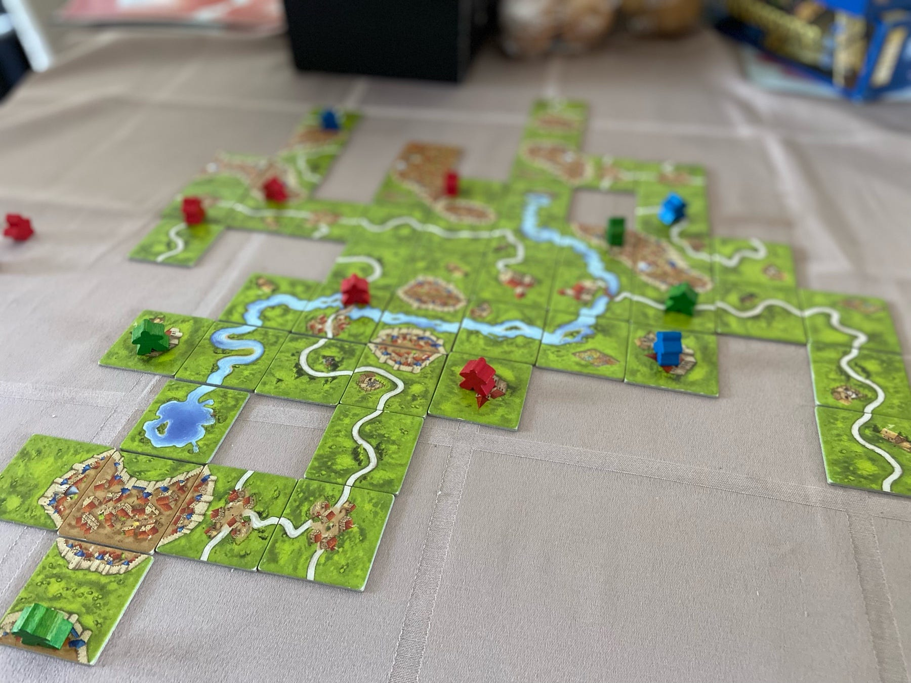

<figure>

</figure>

A veces, un sábado por la tarde, después del almuerzo, cuando la pesadez de un pescadito frito con patacones y el sopor del calor nos sujetan como una fuerza callada e inexorable, esa especie de imán invisible que convierte el sofá en destino inevitable, ellos aparecen con sus reclamos luminosos: *juguemos Uno*, *bájame el Monopolio*. Peticiones que parecen inoportunas, a las que respondemos con un “más tarde” que casi nunca llega. Y entonces, sin darnos cuenta, dejamos escapar una oportunidad de oro.

Tras la insistencia, uno cede, abre el juego. Esa partida pocas veces llega al final, quizá haya que cambiar de tablero, quizá uno termine frustrado. Pero la verdad es otra: no quieren el juego en sí, lo que quieren es a uno. El regalo es ese tiempo compartido, la risa breve, el gesto sencillo de apartar las distracciones, arremangarse y sentarse con ellos a jugar.

Porque en un pestañeo dejarán de pedirlo, y uno se quedará añorando las ocasiones que despreció sin darse cuenta. Y es que en esas cosas pequeñas —esas fichas desperdigadas sobre la mesa, esas reglas olvidadas, ese desorden feliz – se tejen los recuerdos que sostendrán la memoria de una familia. Esa es la verdadera inmortalidad: vivir en la conciencia de los hijos, en las lecciones que ellos dejarán a los suyos, como un eco interminable en el tiempo.
