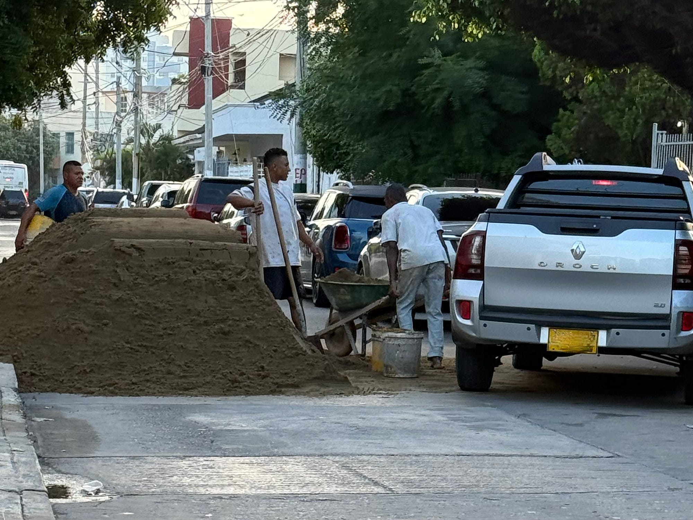

<figure>

<figcaption>Un viaje de arena en plena calle: estorba el paso, pero enciende la conversación.</figcaption>
</figure>

“Papi, el sonido ese… me pone la piel de gallina”. Así me describe Elena la sensación que le produce el roce de la pala contra el suelo al levantar la arena y volcarla en la carretilla. Le digo que es parecido a cuando alguien hace rechinar las uñas sobre una superficie — y lo curioso es que con solo pensarlo evocamos los dos esa misma corriente de escalofrío, un estremecimiento que nace en la nuca y baja despacio por la espalda.

Sonreí con ella y le dije: “así somos los seres humanos, habitados todavía por misterios sencillos que compartimos sin entender del todo.” Es algo primitivo, como un eco antiguo que nos recuerda que alguna vez fuimos animales y aún guardamos huellas de esa memoria arcaica.

Antes de terminar mi rudimentaria explicación neurológica ya estábamos cruzando la calle. Dimos unos pasos más y le pasé la lonchera. La besé en la frente y le deseé un día maravilloso.

Y es así como lo que parece un día cualquiera nunca lo es del todo. Cada jornada trae un destello, una conversación, una chispa que se guarda en la infancia y en lo que une a un padre y una hija. Como el roce de una pala en la arena — ese sonido áspero y vital — queda vibrando en la memoria, recordándonos que lo más simple nos atraviesa a todos, que basta un sonido para erizarnos y conectarnos con lo esencial de nuestra historia compartida.
