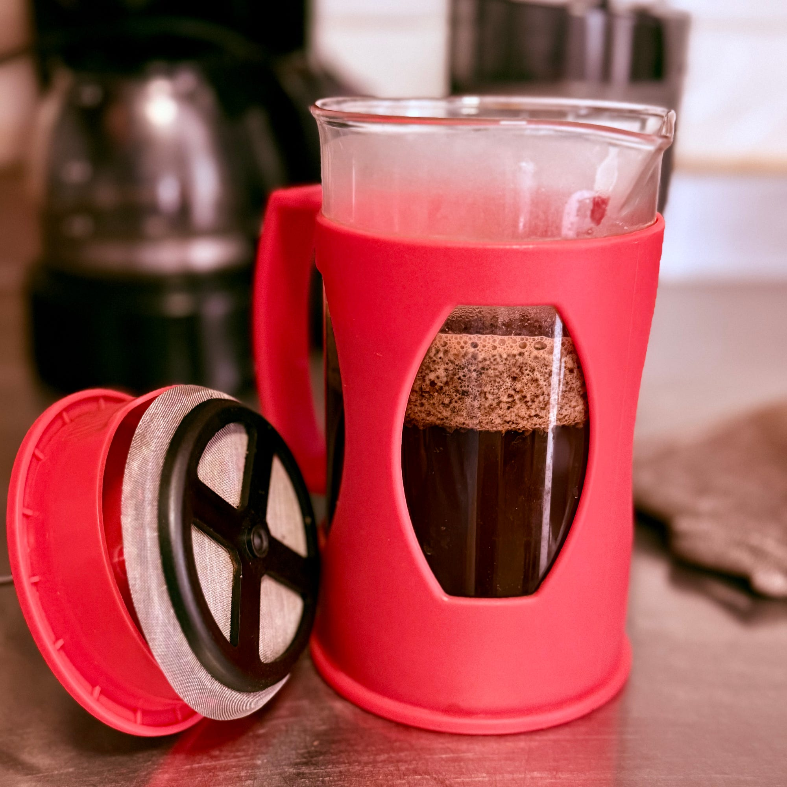

<figure>

<figcaption>El ritual sencillo de un café, la paciencia de hacerlo bien.</figcaption>
</figure>

Un café es una excusa para el encuentro. Ese que preparo yo mismo, que muelo y elaboro al punto de lo que le gusta a mi paladar — y al de ella, que no es poca cosa. Ese café no es fácil, pero ciertamente placentero. Y no es fácil porque requiere balance entre el cuerpo que tanto me gusta y la ligereza que ella busca. La verdadera armonía del encuentro. Alcanzar ese equilibrio es un arte, la melodía que un buen maestro aspira a dominar.

Para comenzar, el balance y el cuerpo son fundamentales para la base — ese cimiento que nos da textura y seguridad de dónde agarrarnos. Sin esa base no se consigue nada. Esos cafés demasiado aromáticos y ácidos tienen poco cuerpo y complican el asunto. En cambio, algo más terroso, con ese aroma punzante que se queda en la nariz y despierta la lengua, es apenas lo justo para el encuentro de nuestros paladares.

Y aún con todo esto, falta algo más. Porque hay truco, siempre hay truco. Es tan sencillo como inesperado: un chorro de agua caliente a su café justo antes de servir para buscar el perfil que ella anhela y mantener el cuerpo que mi paladar busca. Como la corteza crujiente y el interior tierno de ese pan tibio que perfuma la memoria.

Es así como, con atención y cuidado, se hace un café y se cuece una relación. Lo sabía también Tolstoi: si hay tantas mentes como cabezas, entonces hay tantos tipos de amor como corazones. Para cada corazón existirá su café.

El secreto del buen café no está en conocerlos todos ni en dominar cada forma de prepararlos, sino en tener el cuidado y la paciencia de apreciarlo y disfrutarlo. Como el cuidado para amar a una mujer. El truco está en la hondura con que se conoce: su textura y su aroma, sus gustos y sus ansiedades. Esa paciencia es virtud, como la selección de buenos granos para lograr un buen café.

Al final, un café no es solo un café, es la excusa para encontrarnos, la paciencia de prepararlo y la dicha de compartirlo. Porque el verdadero secreto no está en el grano ni en el agua, sino en la atención que nos damos al saborearlo juntos.
