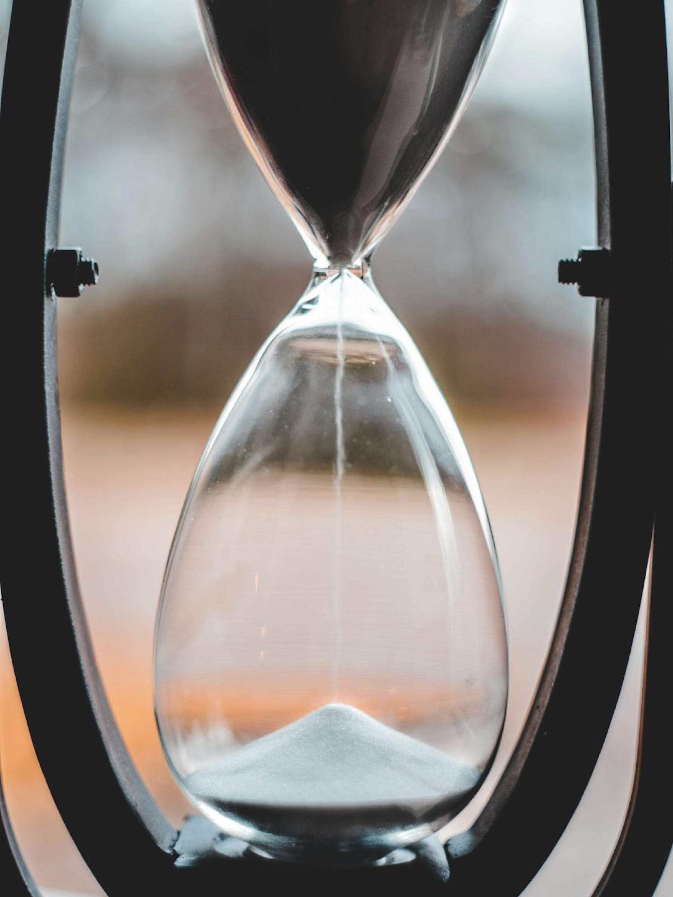

<figure>

<figcaption>Photo by <a href="https://www.jacksharp.photography" class="markup--anchor markup--figure-anchor" data-href="https://www.jacksharp.photography" rel="noopener" target="_blank">Jack Sharp</a> on <a href="https://unsplash.com/?utm_source=medium&amp;utm_medium=referral" class="markup--anchor markup--figure-anchor" data-href="https://unsplash.com/?utm_source=medium&amp;utm_medium=referral" rel="noopener" target="_blank">Unsplash</a></figcaption>
</figure>

Cuando las piernas flaquean y la pesadez, que suele andar por dentro escondida y callada, se presenta tras una noche de insomnio, el día se vuelve espeso. No alcanzan las tazas de café para traer de vuelta el aliento.

El miércoles parece martes y el martes fue un lunes disfrazado, después de un puente largo cuyo cierre abrupto alcanzó a inquietar hasta al más calmado.

La semana avanza, sí, pero cada segundo cae en cámara lenta, como granos de arena tercos que no quieren deslizarse en el reloj. Se quedan arriba, aferrados, negándose a colaborar, como si el río de la vida hubiese entrado en un breve remanso detenido. Esta semana esa máquina anda distinta, suspendida en una modorra que recuerda el calor quieto de una tarde caribeña.

Así caminan los días de letargo, con la respiración corta, buscando que la rutina vuelva a sentirse rutina y que la cadencia retome su compás. Es como esa sensación frágil que tratas de sostener, igual que cuando crees haber atrapado una polilla pero no estás seguro. No quieres abrir la mano porque puede escapar, pero tampoco sabes qué encontrarás cuando lo hagas.

En esa búsqueda voy hoy, siguiendo el hilo tenue del ánimo que deambula por algún rincón de la casa, esperando que vuelva a posarse donde pueda hallarlo.
