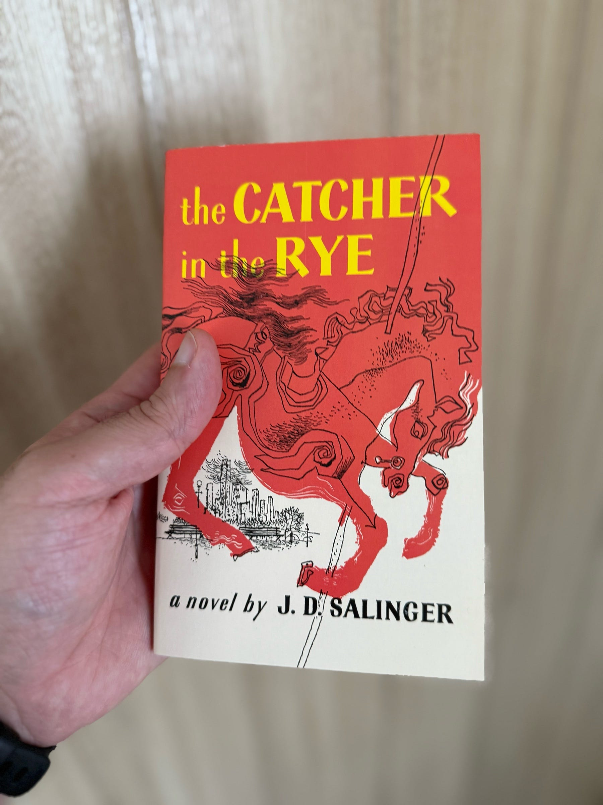

<figure>

</figure>

Recordar a Holden Caulfield es volver a ese rebelde melancólico que, en la adolescencia, ansía un amanecer distinto. Uno cree entonces que lo que falla es el mundo, que todo está mal puesto, que los adultos son falsos y que la vida debería ser otra cosa. Con el tiempo —y quizá ya al final del libro – Holden intuye que esa añoranza es, en buena parte, baldía. No porque sea falsa, sino porque no apunta a un gran cambio épico, sino a algo más simple.

Lo que de verdad desea es pasar un día bueno. Estar con alguien a quien quiere. Subirse a un carrusel y mirar. Dejar que llueva, mojarse, no preocuparse. Entender, aunque sea por un momento, que la vida no se juega en el “qué dirán” ni en la pose defensiva, sino en esos instantes frágiles en los que uno baja la guardia y acepta el mundo como es.

Quizá por eso hoy regalo este libro a mis hijos adolescentes. No para que encuentren respuestas, ni para que imiten a Holden, sino para que se reconozcan en su incomodidad. Para que sepan que sentirse fuera de lugar no es un defecto, y que crecer no consiste en perder esa sensibilidad, sino en aprender a cuidarla.
