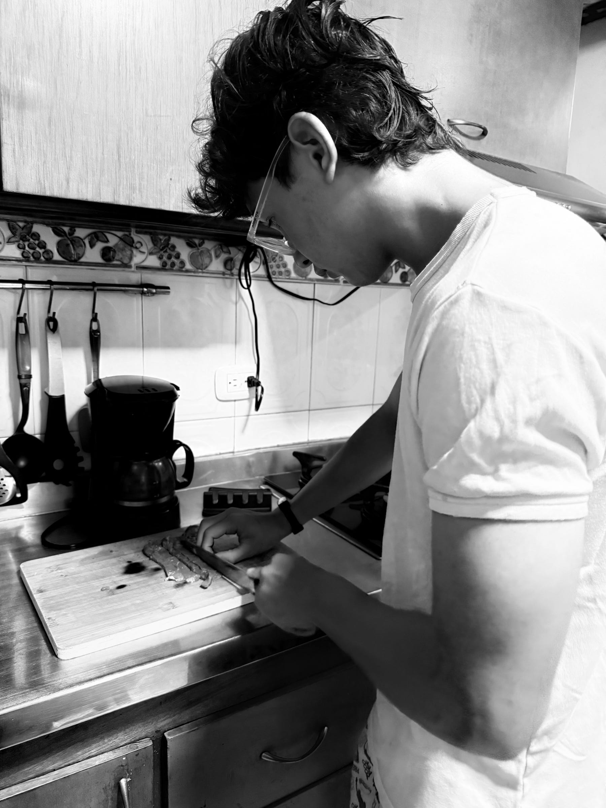

<figure>

</figure>

Cuando tu hijo te dice que quiere ayudar a preparar la cena, tú lo dejas. Pero no te apartas. Lo acompañas. Y así comienza algo hermoso, una forma de estar juntos donde se intuye lo que puede ser y lo que aún está por crecer.

En toda conexión entre padre e hijo hay un interés común. Algo que los une más allá de lo banal, no las cosas, sino los actos que exigen atención, cuidado y una cierta entrega silenciosa.

Siempre he creído que la cocina es una de las mejores escuelas para la vida. Hay que planificar, sí, pero también aprender a improvisar cuando las cosas no salen como las imaginas. Hay que tener paciencia y seguir instrucciones, o al menos ciertos protocolos que otros pensaron antes. Saber cuándo innovar y cuándo no. Y, sobre todo, aceptar que muy pocas cosas salen bien a la primera. Con el tiempo, la repetición y el error, la experiencia nos permite hacer cosas que antes parecían imposibles.

Esa experiencia acumulada no se improvisa. Esa es quizá la lección más honesta. De ahí nace la posibilidad del éxito y también la forma de levantarse cuando algo falla.

Un corte de carne. Salpimentar con calma. Saltear en el wok y servir. Son pasos simples, pero en ellos vive una metáfora del cuidado por el detalle, de lo íntimo y de lo hermoso que se construye sin ruido.

Son estos los momentos que se vuelven tesoro. Los instantes discretos donde ocurre la verdadera magia de tener hijos. Tal vez por esto nos hacemos padres. Porque en medio de algo tan simple como una cena se nos entrega, sin que nadie lo explique, una forma de estar en el mundo juntos. Y un día entiendes que no solo estás enseñando a cocinar, sino a mirar, a esperar y a cuidar.

Entonces tu hijo vuelve a decir que quiere ayudar, y tú lo dejas, como quien pasa una llama pequeña que espera seguir encendida en otras manos.
