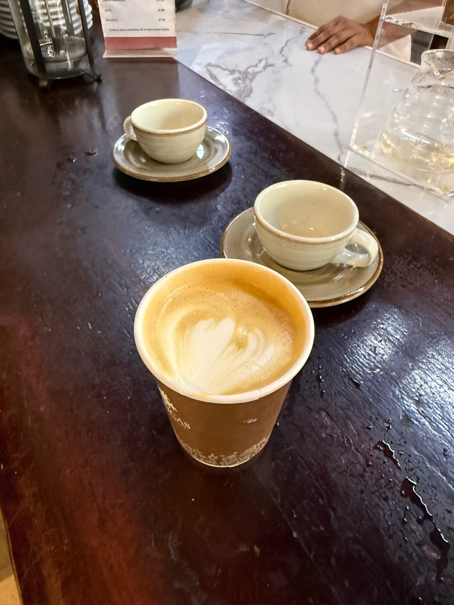

<figure>

</figure>

Dicen que toda buena conversación comienza con un café. Yo he descubierto que toda buena relación entre padre e hijo también empieza con una excusa para tomar algo juntos.

En los azares de la vida, una tarde cualquiera aparece y le pido a mi hijo Alejandro que me acompañe por un café. Ya está grande, más alto que la última vez que me fijé, pero todavía carga en la mirada algo distraído y sin sospechas, como si el mundo aún no le hubiera pedido cuentas. Gira despacio, sonríe, encoge los hombros, aprieta los labios y asiente.

Caminamos y conversamos bajo un cielo nublado, en una tarde lenta, con una brisa apenas salada que roza la piel y la deja despierta.

Llegamos al puesto y nos recibe una mujer de unos cincuenta años, sonrisa abierta y una mirada que abraza sin tocar. Luz Estela, dice la etiqueta en su pecho. Nos saluda con un gesto que parece abrir la puerta de su propia casa.

– ¿Qué se les ofrece?

Un capuchino, respondo, devolviéndole la sonrisa.

Le pregunto a Alejandro si quiere café. Encoge los hombros y dice que no sabe, que no le gusta. Frente a nosotros, un filtro de tela sigue goteando con paciencia. Luz Estela se adelanta y le pregunta por qué no le gusta. Él responde que por el amargor. Entonces ella le propone probar un café campesino, preparado allí mismo, con un poco de canela y panela. Le dice que no es tan amargo, que es más amable con el paladar.

Mi hijo mira a ambos lados, como buscando una señal secreta, y asiente. Lo probará. Ella remata con una promesa que suena a complicidad.

– Si no te gusta, no te lo cobro.

Él sonríe, ya casi convencido.

Mientras van las tazas, el filtro y el murmullo del agua caliente, conversamos. Le señalo la prensa francesa a un lado, el V60 al otro, y hablamos de café y de la vida como si fueran la misma cosa. En un momento, Luz levanta la mirada y le pregunta si estudia. La pregunta cae con esa naturalidad que da por hecho la universidad. Alejandro responde que sí, casi por reflejo, sin notar del todo el tamaño de lo que le están concediendo.

Ella sigue y le dice que cuando deba estudiar hasta tarde puede tomar un café así. Yo sonrío en silencio. Aún le faltan un par de años para esas desveladas universitarias, pero algo en su postura, en la forma en que sostiene la taza, hace que la confusión resulte justa, casi profética. Precalienta dos tazas y nos anuncia que lo dividirá en ambas para que yo también lo pruebe. Sonríe con picardía. Sabe que así nadie se salva de pagarlo.

Empieza con el agua caliente. Disuelve la panela y la canela con una delicadeza que parece un rito. Luego vierte el agua en círculos lentos y nos explica por qué lo hace así, para lograr una buena extracción. Los aromas se levantan como si la tarde se desperezara de pronto, como si algo nos tomara del mentón y nos invitara a mirar el mundo con ojos nuevos.

Sirve las dos tazas. El futuro aún no se ha dicho. Alejandro estira la mano y toma la suya. Le cedo el primer sorbo para mirar su rostro. Entorna los ojos mientras el sabor ocupa su boca. Luego los abre, como quien descubre un secreto sencillo.

– Está bueno —dice, y vuelve a beber.

Yo pruebo el mío. Es un buen café para un paladar que apenas empieza. El dulzor leve abraza, se queda. Le digo que me alegra que le guste.

Degustamos en silencio, pero no es solo café lo que compartimos. En su cara adivino un aire nuevo, una sombra de madurez que se posa sin hacer ruido. Ha cruzado un umbral pequeño y enorme a la vez, el de encontrar placer en algo que antes le parecía ajeno.

Y así, en una tarde nublada con brisa suave, entre el vapor de dos tazas y una conversación sin prisa, descubro que mi hijo ha crecido un poco frente a mis ojos, sin saberlo, mientras yo aprendo a mirarlo de nuevo, como si el tiempo también pudiera servirse caliente, a sorbos lentos.

Por eso agradezco estos lugares sin apuro, donde nadie te mide por la rapidez con que pides ni hay una fila que empuje las palabras hacia el silencio. Espacios donde uno puede quedarse, conversar, mirar a quien tiene al lado como si no hubiera nada más urgente. Es en intercambios así, sencillos y tibios, donde la vida, sin anunciarse, cobra sentido.
