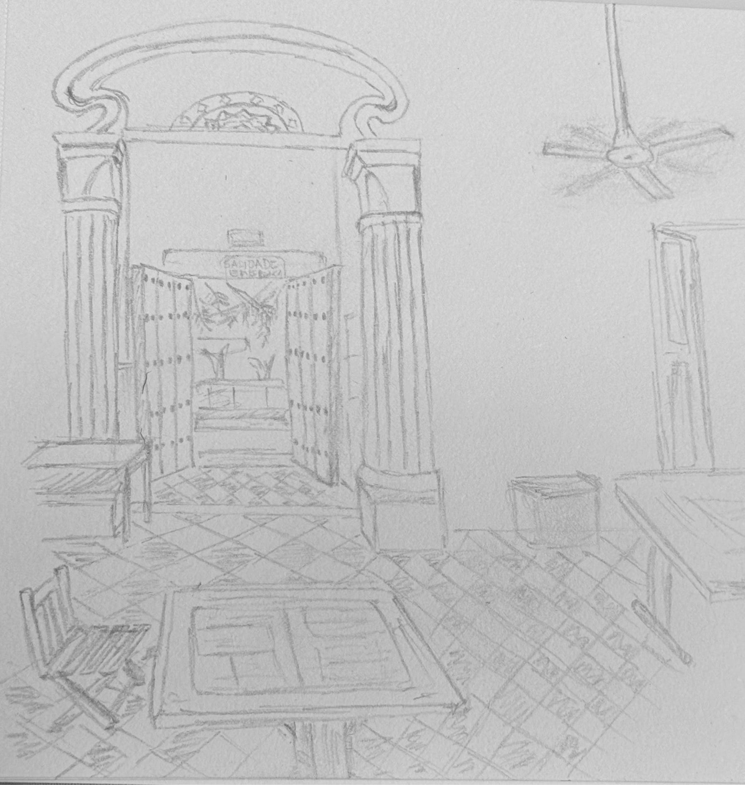

<figure>

</figure>

– Hola, me llamo Simón y te haré la entrevista, ¿te parece bien aquí?

– Sí —contestó Nico con algo de reserva.

Tomó asiento. Bajo la mesa, sus manos frías se buscaron y se entreveraron, como si quisieran hacerse invisibles. Se preparó para lo que parecía un regalo envuelto. Lo esperó tanto que ahora le daba miedo romper el papel.

La entrevista empezó así, como empiezan las cosas importantes cuando uno tiene trece años. Una pregunta simple y un silencio grande. Yo estaba a un lado, en la misma mesa, con las manos sobre la madera, quietas y visibles, como quien acompaña sin estorbar.

Al fondo se veía el portón por el que habíamos entrado, abierto de par en par, ese de tablones gruesos tan común en las casonas del centro. Por ahí seguía entrando gente, y una moto pasó en la calle y se oyó, breve, como un pellizco de realidad. Nico no volteó. Siguió mirando a Simón.

– Te preguntaré por cosas de tu vida, de tu familia, de ti y tu cotidianidad. Se vale no responder o decir no sé.

Nico sólo asintió. Sus manos seguían escondidas.

– D’accord, tu peux te présenter?

– Je m’appelle Nicolas et j’ai treize ans —respondió, con un acento impecable a pesar de la timidez.

Lo había practicado en su mente muchas veces. Esa primera certeza le aflojó un poco el cuerpo. Vi cómo respiraba mejor.

– Est-ce que tu peux me décrire ta famille? —preguntó Simón, amable, atento.

– Oui —dijo Nico, sin titubear.

Empezó por su hermana. ‘Ma sœur a huit ans’, dijo, con una naturalidad que me sorprendió. Luego habló de su hermano mayor y después de nosotros.

– Ma mère a quarante et un ans et mon père quarante et un ans.

Simón sonrió, levantó las cejas.

– Ah, ton père et ta mère ont quarante et un ans, tous les deux?

Nico se sonrió también. Se dio cuenta de que se había confundido, pero no se desarmó. En esa sonrisa, pequeña y breve, había algo más valioso que la exactitud.

Siguieron con lo cotidiano. Qué hacía con sus hermanos, qué hacía en su tiempo libre, en qué colegio estudiaba. En un extremo de la mesa estaba mi hijo mayor, callado, escuchando. Su presencia sumaba un poco de tensión, pero también un respaldo silencioso. Era como si Nico supiera que no estaba solo en esa silla.

Mi esposa observaba desde otra mesa con nuestra hija. De vez en cuando me escribía ‘¿Cómo va?’ Yo contestaba poco o nada. No quería que el teléfono me sacara de ahí. Había que estar.

Llegó una pregunta sobre la profesora de francés.

– Elle est pas jolie.

Simón se quedó quieto un segundo.

– Pardon? Elle est pas jolie?

Nico asintió, serio. Yo sentí una risa contenida, no por burla, sino por ternura ante lo frágil que puede ser una palabra.

Al salir, ya caminando por San Diego, Nico me confesó lo que había querido decir. Creía que jolie era “feliz”, o algo cercano, porque la profesora era seria. Cuando le dije que significa bonita, rompió en risa. Fue una risa que lo alivió, como si se hubiera quitado una camisa apretada.

La entrevista siguió. Pasatiempos, música, película favorita. Mario Bros. La trama. Los personajes. Se le coló una palabra en inglés, “adventures”, y luego otra en español, “planetas”. Pero ya estaba hablando. Ya se había montado en la historia y no quería bajarse. Y entonces vi el cambio. Sus manos, por primera vez, aparecieron sobre la mesa, tímidas, como si probaran el mundo.

Hasta que llegó lo que temía.

– Qu’est-ce que tu as fait à Noël?

Nico frunció el ceño y giró la cabeza apenas. Simón repitió la pregunta y, con la mano, insistió en el pasado. Yo sentí el impulso inmediato de soplarle una forma verbal, de ponerle el camino frente a los pies. Mis labios se movieron casi sin querer, pero me contuve. Lo dejé seguir.

Nico abrió la boca para ganar tiempo con un “ajá”. Y luego dijo, con la valentía de quien pisa donde no está seguro.

– Je voyage à Bucaramanga pour voir mes cousins.

Simón lo miró, como preguntándose si ese viaje era ahora o fue. Nico lo entendió de inmediato. Se le notó en los ojos, en un descenso breve. El pasado era un hueco que él conocía. Justo por eso estaba ahí.

Simón no lo empujó más. Cerró con calma.

– Très bien.

Y terminó la entrevista.

Nico volvió a mirar la mesa. Sus manos reaparecieron, abiertas. Lo peor ya había pasado.

La siguiente etapa era el examen escrito. Ese era su terreno.

Tomó el lápiz y arrancó. Primer ejercicio. Segundo. Pasó la página y siguió, como un bólido. En menos de diez minutos ya había terminado. La satisfacción se le notaba en la cara, pero también en las manos, plenamente sobre la mesa, sin esconderse.

Simón lo felicitó por la pronunciación y por lo que había logrado muy bien. Yo lo miré y pensé en esa diferencia sutil que solo se ve cuando uno ha estado ahí mirando. El niño que entra cuidando sus manos debajo de la mesa no es el mismo que termina gesticulando, explicando una película, intentando un pasado.

Cuando nos levantamos, el portón seguía al fondo, abierto, dejando entrar y salir gente como si no pasara nada. Simón sonrió al despedirse.

– Ça va?

Nico lo miró y respondió con una calma nueva.

– Ça va.

Y al cruzar ese portón, tuve la impresión de que algo en él había cambiado de lugar, como cuando una palabra por fin se queda donde debe. No fue una hazaña. Fue una victoria pequeña, de esas que un día, sin avisar, te muestran que tu hijo se creció.
