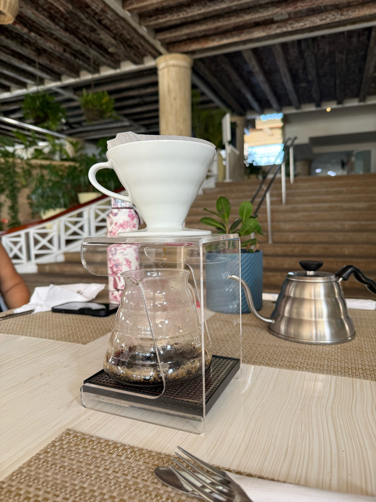

<figure>

</figure>

El aire fresco y salado se desliza por nuestra mesa mientras escuchamos la explicación impecable de lo que será el café que pronto probaremos. Un V60. Un café volcán de Juan Valdez, cultivado a 1800 metros sobre el nivel del mar. Resulta curioso que esos granos recogidos a cientos de kilómetros, en los Andes colombianos, los estemos disfrutando aquí, al lado del mar Caribe. Montaña y costa conversando en una misma taza.

La barista continúa. Luz Estela —ya una vieja conocida – explica que ha precalentado el filtro para que todo salga bien. Siete gramos por cada taza, insiste, mientras nos mira como quien invita y no juzga. Hay algo de ceremonia en sus gestos. Algo que recuerda ese café que ofrece Olenka en La querida de Chéjov: entrega total, apertura a lo que venga.

Giro y miro a mis dos acompañantes. Una ligera sonrisa compartida. Aguardan el café. Pero también aguardan otra cosa. Una tensión leve sugiere que la conversación se ha detenido, esperando la privacidad justa. No la que exige aislamiento, sino la que requiere miradas desinteresadas alrededor, para que todo parezca la charla más banal del mundo. Esa que no resuelve nada y lo calma todo.

Mis hijos cruzan el fondo de la escena como música incidental. No interrumpen. Acompañan. Son parte del paisaje vivo que sostiene la conversación adulta, como si el tiempo se estirara lo suficiente para incluirlo todo.

Así, un día sin nada extraordinario se convierte en uno que lo contiene todo. Una celebración anticipada de cumpleaños. Un bocado de aguacate con una pizca de sal marina que abre el apetito. Un bizcocho que nadie se atreve a empezar. Una michelada con ese toque de limón que apaga la sed y despierta la risa.

La tarde termina y comienza al mismo tiempo. El sol cae sobre el mar abierto y cercano. La brisa arrulla lo que no se dice. Tres voces se entrelazan en confidencias y anhelos. Y queda, casi imperceptible, un hilo que nos une: la experiencia compartida, la certeza tranquila de estar donde debemos estar, dejando una huella suave —pero real – sobre esta tierra.
