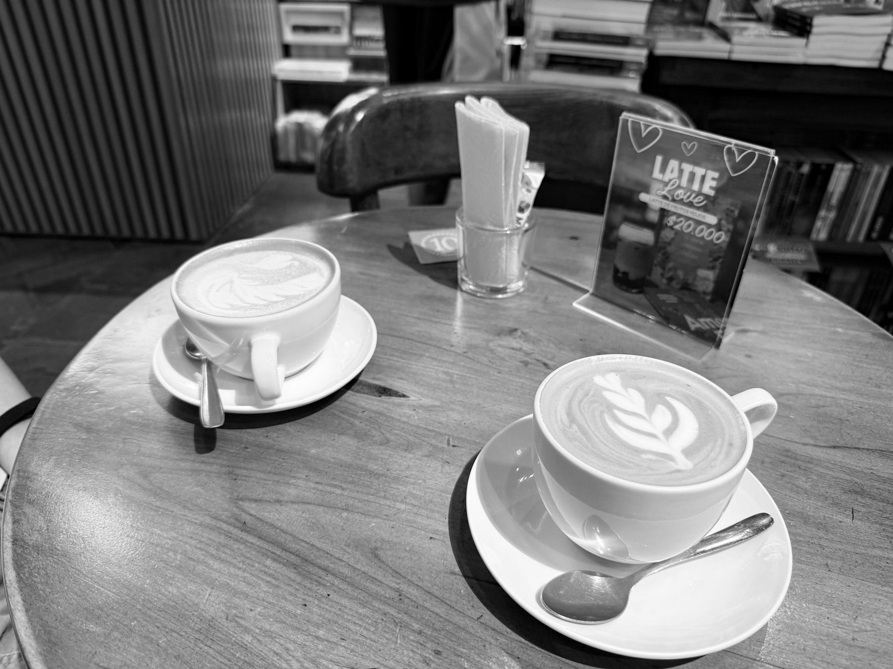

<figure>

</figure>

– Papi, salgamos.

– Ok, ¿a dónde quieres ir?

– Al centro comercial.

– ¿A cuál?

– Al que sea.

Lo dice Nico con ese anhelo simple de quien quiere salir y espantar el aburrimiento de una tarde en casa. Sus hermanos están por fuera y él se ha quedado solo conmigo, mientras un partido del Barça suena al fondo, como una presencia lejana.

– ¿Y si hacemos algo diferente?

– Ok, dale, pero salgamos.

Así comienza una tarde en la que no buscábamos una aventura. Solo algo bueno en qué pasar el tiempo los dos.

Después de pensarlo un poco, se me ocurre que podemos ir al centro y caminar. Tal vez tomarnos algo o comer una paleta. Una idea llama a la otra y entonces pienso en Ábaco, la librería café del centro. Hace muchos años que no paso por ahí y nunca he llevado a mis hijos.

– Dale, ya sé qué haremos. Vamos a Ábaco y nos tomamos algo.

Él responde que está bien, siempre y cuando salgamos.

Nos alistamos y salimos en el carro. Vamos hacia el parque de la Marina para dejarlo, pero hay un camión de Argos atravesado, haciendo quién sabe qué obra nueva del alcalde, y no podemos pasar.

Nos desviamos y logramos entrar por el boquetillo. Vamos andando despacio, como quien busca un hueco por donde meterse un rato y dejar el carro. Y así, sin más, aparece un tipo con gorra azul de los Blue Jays y nos señala que hay un espacio frente al Claustro de la Merced. Nos cuadramos y queda todo listo para caminar por las calles del centro histórico, esas donde uno siente que la ciudad sigue siendo la misma y ya es otra.

Nos metemos por la calle de Don Sancho y Nico me pregunta por qué se llama así. No tengo una respuesta clara. Le digo que seguramente se debe al nombre de alguien que vivió allí, como pasa con tantas calles viejas, que parecen guardar todavía el eco de quienes las habitaron.

Seguimos andando con más ánimo de llegar a la paletería, pero primero se nos atraviesa Ábaco y no me puedo resistir.

– Nico, entremos y miramos a ver si nos tomamos algo.

La clásica expresión caribeña de no estoy seguro, pero vamos viendo.

Entramos y hay más extranjeros que locales en ese espacio acogedor, lleno de libros y con aroma a café, en medio de ese aire húmedo de Cartagena que allí adentro queda domado por el aire acondicionado. El zumbido ligero del aparato acompaña el lugar como una respiración constante.

Nico, entre la inocencia y el asombro, no sabía bien qué hacer. Le puse la mano en el hombro y le dije que nos sentáramos a mirar. Una chica de gafas amarillas muy llamativas, ojos pequeños tras la severidad evidente de su miopía y una sonrisa amable, nos invitó a pasar y nos preguntó qué queríamos. Asentí cuando dijo que tenían diversas bebidas y le pedí el menú.

Nos lo trajo pronto y ya comenzábamos a conversar entre estanterías llenas de libros, en medio de ese aroma que tienen algunos lugares donde uno siente, casi sin darse cuenta, que pensar todavía vale la pena.

Nico no sabía bien qué pedir. Le sugerí un mocachino. Le expliqué que era como un capuchino, pero con cocoa. Dijo que sí. Yo pedí un capuchino.

Cuando llegaron las bebidas, comenzó de verdad la tarde.

Hablamos de los libros en la estantería detrás de nosotros. Miré rápido y vi 1984, de George Orwell. Le dije que era tremendo libro y que se lo recomendaba. Entonces me acordé de que esta semana había grabado en el celular una frase de Orwell. Se la mostré. Sonrió y luego me miró con esa expresión suya de cuando algo le hace sentido de verdad.

> “If people cannot write well, they cannot think well; and if they cannot think well, others will do their thinking for them.”

> – George Orwell

Después de varios sorbos de café, la conversación fue cogiendo una hondura tranquila, como pasa a veces cuando nadie está tratando de impresionar a nadie.

Me preguntó qué quería estudiar yo cuando tenía su edad. Le conté que una vez hice un proyecto sobre el síndrome de células falciformes y que en ese tiempo quería ser biólogo molecular, aunque mi papá insistía en que estudiara medicina. Siempre medicina. Pero yo quería ser científico, no médico. Esa fue, en buena parte, la gran controversia de mi adolescencia.

De ahí pasamos a otros temas. Si él quisiera estudiar en el extranjero, si yo lo dejaría. Cómo había comenzado mi trayectoria académica. Le hablé de mi primer paper. Luego me preguntó si yo disfrutaba escribir artículos científicos. Le dije que sí, mucho. Que no era fácil, pero que precisamente por eso lo disfrutaba. Hay trabajos que se vuelven más propios cuando exigen algo de uno.

En un momento vimos Shōgun, de James Clavell, y comenzamos a hablar del Tratado de Tordesillas. De cómo a Portugal le tocó Japón, sin que los japoneses lo supieran. De cómo controlaban buena parte del comercio y de las relaciones con Japón hasta que un marinero de los Países Bajos se atrevió a llegar por el Pacífico, tras pasar por el estrecho de Magallanes. Le dije que claro, era ficción, pero apoyada en la vida real. Y que la serie reciente estaba fantástica. Que deberíamos verla juntos.

En otro momento me levanté y pedí que me buscaran un libro, Al borde de la esperanza, de José Manuel Restrepo, quien había estado esa misma semana en la universidad conversando sobre educación superior, el rol de la universidad y la crisis democrática que vivimos. Nico estaba muy al tanto de mi agenda y de ese conversatorio. Eso me gusta. Que mis hijos sepan en qué ando, no solo por dónde ando.

Tras el último sorbo de su mocachino, lo vi ya inquieto, mirando alrededor. Le dije que pagáramos y saliéramos a dar una vuelta. Asintió, pero antes dijo:

– Dale, pero voy primero al baño.

Mientras pagábamos, vio otro libro. En realidad, un paquete de tres.

– Papi, ¿quién es Isaac Asimov?

Cuando volteé, vi que era la serie de Fundación. Se me abren los ojos.

– ¿Recuerdas la serie que me estoy viendo estos días? La de la dinastía galáctica, del mismo emperador que se clona sucesivamente.

Me mira y sonríe. No dice nada, pero con ese gesto lo dice todo.

El zumbido del aire acondicionado seguía allí, acompañándonos, recordándonos que sin ese aparato este rincón del Caribe sería un poco más agreste y más cálido. Pero la tarde estaba fresca.

Salimos de la librería. Veo la banca de la entrada con las primeras páginas de Cien años de soledad y le pido a Nico que se siente para una foto. Asiente y pronto comienza a leer: “Muchos años después, frente al pelotón de fusilamiento…”. Luego me mira y me pregunta para dónde vamos.

Le digo que no sé, pero que echemos a andar, porque caminando siempre aparece algo.

Y en ese momento, mientras seguimos por las calles del centro, me doy cuenta de algo sencillo y grande a la vez. Que ya no estoy solo acompañando a mi hijo. También estoy comenzando a conversar con la persona en la que se está convirtiendo. A veces la vida no anuncia esas cosas. Solo las deja aparecer en una tarde cualquiera, entre café, libros y hablar.

De vuelta a la casa, en el carro, me dice:

– Papi, la verdad es que yo disfruto lo que estoy aprendiendo. Reducir expresiones algebraicas, sobre todo las fracciones, es algo que me gusta. A los demás ni les interesa. Lo que estoy viendo en química y en filosofía también me gusta.

Le pregunto qué están estudiando en filosofía y me responde que sobre la verdad. Que le parece fascinante.

Sonrío.

– Nico, eso es una fortuna. Hay personas que tienen un buen nivel de inteligencia, pero no disfrutan aprender. Y hay otras que sí disfrutan aprender, pero les cuesta más. Cuando las dos cosas se juntan, se abre un camino. Aprovecha eso. Úsalo para crecer y para aportar a los demás.

Ya había caído el sol, aunque todavía quedaba algo de claridad en el cielo, esa luz última que en Cartagena parece demorarse un poco más sobre los tejados y las copas de los árboles. Llegando a la casa le pregunté si quería que le preparara una pizza. Me respondió que sí y me tiró un beso.

Esa fue mi tarde de sábado con Nico.

Un tesoro.
