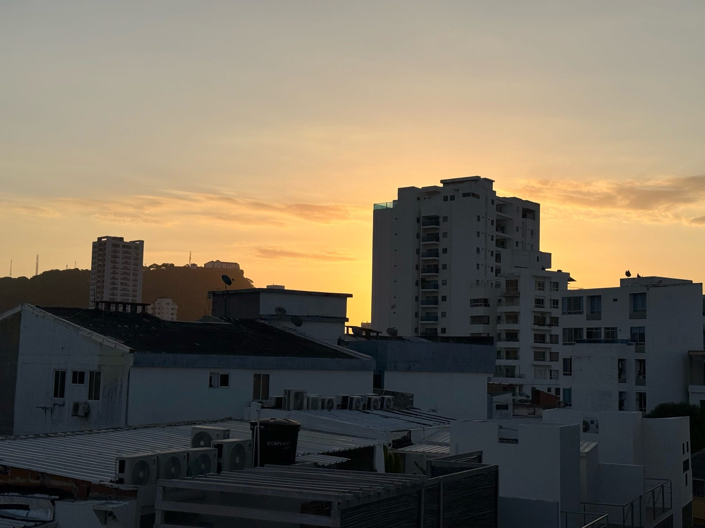

<figure>

</figure>

Hoy amaneció, y esta ligera mañana fresca de marzo se me hizo placentera, amable. Como quien abre los ojos y, todavía con la visión borrosa, mira a su alrededor y descubre que todo es conocido, pero nuevo.

Giro mi cuerpo en la cama y extiendo las manos para abrazar a mi mujer. Sé que ha estado enferma, pero la siento mejor. Respira mejor y tiene una calma tendida que dice de aquí no me muevo. Con una leve contorsión me acomodo y la abrazo intentando perturbarla lo menos posible. Le doy un beso en la espalda y le digo que la amo mientras estiro la mano y la deslizo por su cintura.

Me quedo un rato y disfruto su aroma. Esa calidez de su cuerpo con el mío tiene algo de tregua feliz, de abrigo prestado por unos minutos, porque pronto empieza a estorbar el peso, el calor, la incomodidad de seguir allí. Así que, después de esos minutos maravillosos, me levanto y busco algo, aunque en verdad no sé qué.

Deambulo por el cuarto y tiro de mi Kindle. Leo unas páginas del libro de George Saunders sobre la escritura y los cuentos rusos. Estoy maravillado con esa literatura, pero sobre todo con mi conversación mental con el autor. Con cómo disecciona los cuentos y los ata a la vida cotidiana, a nuestras penas y angustias, pero aún más a eso difícil de nombrar que significa ser humano.

Se me antoja un café y tiro para la sala. Agarro mi teléfono y el Kindle mientras veo de reojo el rostro plácido de mi mujer reposando sobre la almohada. La luz suave de esta mañana entra por nuestra ventana, rebotada desde los árboles de mango de la casa de al lado. Nuestra ventana mira hacia el oeste y por eso el sol no nos despierta – nos susurra.

Ya en la sala comienzo a abrir las ventanas y el día empieza a cobrar vida, como la tierra cuando al fin recibe la primera lluvia después de meses de verano y algo, sin hacer ruido, empieza a ceder y a germinar. La imagen de ese sol que va subiendo por el horizonte, marcado por edificios y el cerro de La Popa, sutil pero imponente, se me queda plasmada en la retina. No sé por qué, pero me transporta a un pasaje de Tolstoy que tengo grabado como si fuera la mejor descripción de una mañana que he leído.

Lo busco y resulta que mi memoria me había traicionado. No era de la mañana sino de una tarde. Pero en mi mente sigue siendo igual de hermoso.

> It was bright and sunny. A fine rain had been falling all the morning, and now it had not long cleared up. The iron roofs, the flags of the roads, the flints of the pavements, the wheels and leather, the brass and the tinplate of the carriages – all glistened brightly in the May sunshine. It was three o’clock, and the very liveliest time in the streets.

> Leo Tolstoy in Anna Karenina

Cuando leo esas palabras es como si me metiera en esas calles y viera los destellos del sol sobre los techos, las piedras, los carruajes y todo lo metálico que la luz toca. Es una bella descripción y una espléndida manera de empezar una historia.

Entonces recuerdo que tenía la intención de preparar un café. Ya que estoy, pongo a hervir unos huevos y voy adelantando el desayuno. El café que siempre compro hoy desprende un aroma nuevo, como si invadiera mis fosas nasales con una confianza antigua. Es el mismo de siempre, pero hoy lo siento distinto.

La cafetera comienza a gotear y se sueltan esos aromas que invaden la cocina y se mezclan con eso que llamamos hogar. Porque tal vez el hogar sea justamente eso. Una mujer respirando en paz al otro lado del cuarto, una mañana fresca de marzo, un pasaje de un libro, la luz rebotando sobre los árboles de mango, el perfil de La Popa, unos huevos hirviendo y el café subiendo despacio. Porque hay mañanas en que la vida no promete nada grande y, sin embargo, lo da todo.
