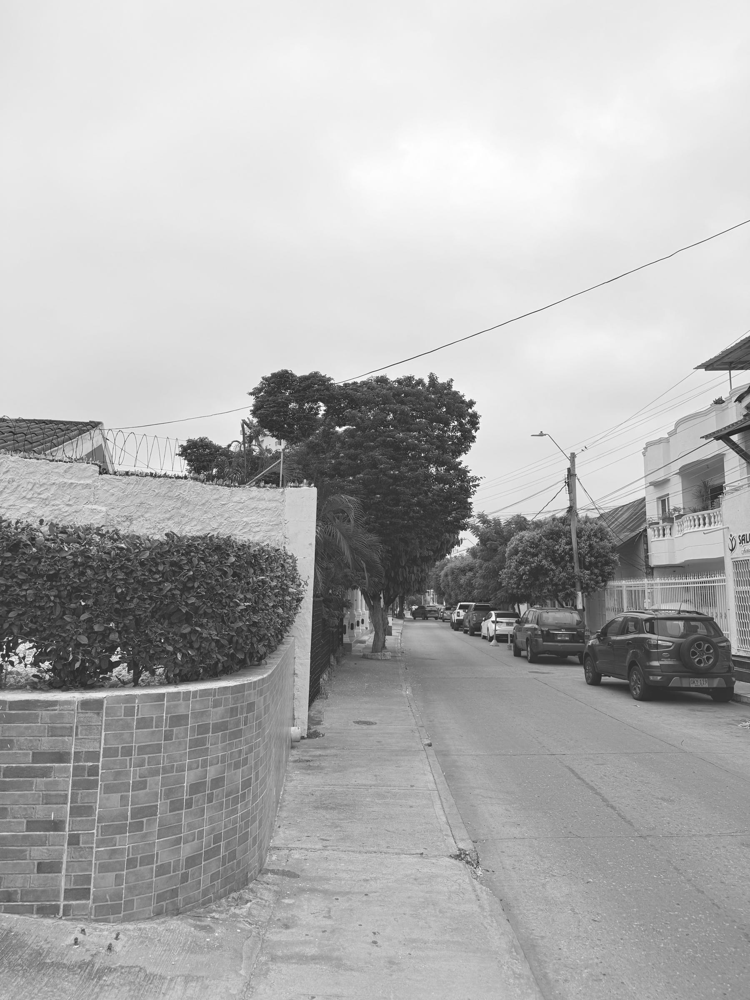

<figure>

</figure>

En una mañana que amanece con el cielo cubierto y el aire espeso regado por todas partes, recuerdo que la vida es esa cosa que pasa y deja en nosotros algo que no sabemos bien cómo nombrar.

Una noche de insomnio da perspectiva, aunque también deja cansancio. Deambular por la noche rumiando las ideas. Esas horas largas donde aparecen cosas increíbles, pero también un letargo donde respirar es ruido. Es, si se puede decir, una especie de maldición bendita, una contradicción de la que no conviene abusar.

Y así amanece y sigo con mi día como si no hubiese pasado nada. Pero la verdad es que el día comienza extraño. Tenía previsto ir al gimnasio con mi mujer, pero las ganas no salen temprano. Y este día nublado, lleno de ese aire cálido y húmedo que templa o derrota a los foráneos, termina marcándonos el paso de las horas.

Por eso, aquí y ahora, me convenzo de que la vida es esta que estoy viviendo y no aquella de la que escribo. La vida es pasar el brazo por la cintura de mi mujer en la cama. Es caminar con Elena al colegio en medio de esa conversación entre padre e hija que parece no agotarse nunca. Es el saludo sobrio de Alejandro, que todavía no termina de despertar, aun con el cabello mojado. Es la alegría de Nicolás por llegar temprano, por ser el primero en entrar al salón.

Todo eso y nada más. Porque los planes del futuro se forman de mañanas como esta. Porque una noche de insomnio no dice mucho, pero dice inquietud. Dice que el futuro es incierto, pero que entre suspiros, sonrisas y recuerdos vivimos para que, cuando llegue ese futuro, podamos reconocerlo sin sorpresa, como se reconoce una calle bajo el cielo cubierto y el aire espeso, mientras la vida pasa otra vez delante de nosotros, sin hacer ruido.
