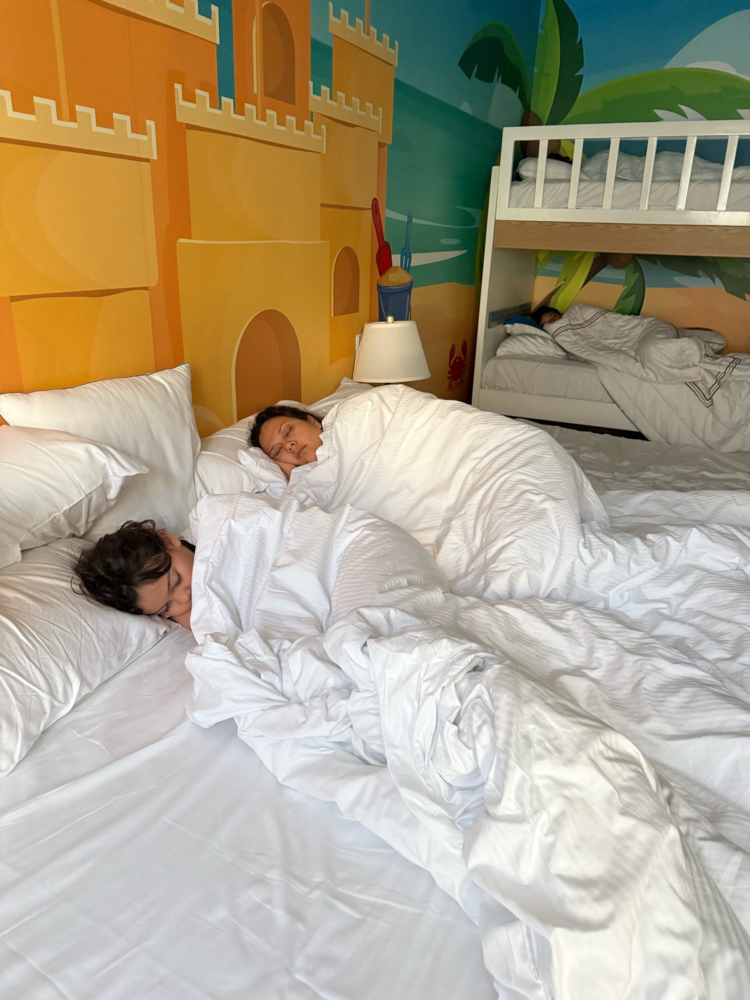

<figure>

</figure>

La mañana comenzó antes de que empezara del todo. No por el ruido ni por la prisa, sino por esa serenidad rara que a veces deja una noche sencilla y feliz. Veníamos de una tarde sin derroche, de piscina, de una cena italianísima y de una copa de vino tinto que me había aflojado el cuerpo, dilatado las pupilas y encendido una nostalgia leve. No era tristeza. Era más bien esa conciencia callada de que estos momentos no se repiten mucho, y por eso mismo se quedan. Al salir del restaurante, una brisa fresca nos levantó el ánimo a todos y nos invitó a recogernos temprano.

Ahora, temprano en la habitación del hotel, nos sigue arrullando el zumbido constante del aire acondicionado central. Estas cobijas gruesas invitan a quedarse un rato más, a echar pereza sin culpa. El ligero ronquido de mi mujer nos recuerda que seguimos suspendidos en esa frontera tibia entre el sueño y el día. Su gesto sereno casi no se inmuta mientras duerme, pero sé que es feliz.

Alejandro parece encontrar la felicidad dando vueltas en la cama. Se reacomoda más que un perro buscando dónde dormir. Pero ese entusiasmo suyo por explorar, por conocer, por asomarse al mundo, es muchas veces lo que termina moviendo a esta familia.

Moverse mucho debe ser un rasgo nuestro. Nicolás se estira y se recoge sin cambiar de lugar, aunque siempre mantiene el rostro inalterable allá arriba, en la cumbre de almohadas. Es un clon de Lenny para dormir, con la diferencia de que le gusta levantarse temprano.

Temprano es también Elenita, mi compañera de cama. Aunque le cuesta desperezarse, no le gusta levantarse tarde y siempre intenta ganarle a los hermanos. Aquí está al lado mío, todavía atrapada entre la pereza y el sueño, pero con esa dulzura en la mirada que parece decirme en silencio: “Papi, estoy lista para lo que sea”.

En esta mañana lenta y fresca, con el sol apenas asomándose y prometiendo abrasar el día, respiro despacio. Los párpados todavía me pesan un poco por la somnolencia que sigue flotando en la habitación, pero siento el corazón hinchado.

Pienso entonces que quizá la vida termina siendo esto. No los grandes viajes ni las celebraciones extraordinarias, sino estas pausas pequeñas y tibias que después, sin darnos cuenta, se convierten en el lugar al que uno vuelve para recordar que fue feliz.
