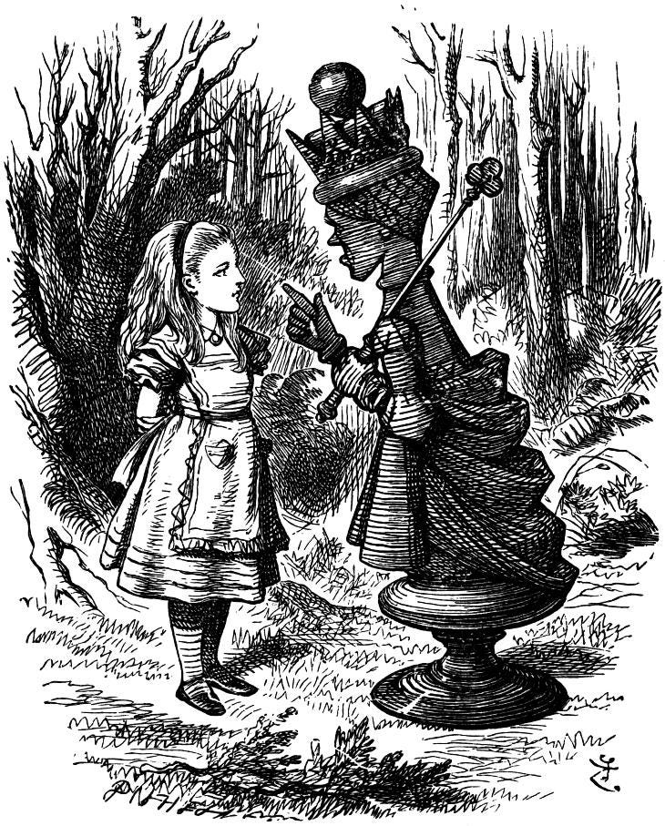

<figure>

<figcaption>By John Tenniel — <a href="http://www.fromoldbooks.org/LewisCaroll-AliceThroughTheLookingGlass/pages/036-red-queen-chastises-alice/730x907-q75.html" class="markup--anchor markup--figure-anchor" data-href="http://www.fromoldbooks.org/LewisCaroll-AliceThroughTheLookingGlass/pages/036-red-queen-chastises-alice/730x907-q75.html" rel="nofollow noopener" target="_blank">http://www.fromoldbooks.org/LewisCaroll-AliceThroughTheLookingGlass/pages/036-red-queen-chastises-alice/730x907-q75.html</a>, Public Domain, <a href="https://commons.wikimedia.org/w/index.php?curid=3585837" class="markup--anchor markup--figure-anchor" data-href="https://commons.wikimedia.org/w/index.php?curid=3585837" rel="nofollow noopener" target="_blank">https://commons.wikimedia.org/w/index.php?curid=3585837</a></figcaption>
</figure>

Una metáfora es esa imagen mental que se fija y perdura, que acerca y ayuda con el entendimiento, así sea aproximada y no del todo precisa. Pero ese es su poder.

Ayer conversaba con un colega sobre la trayectoria profesional y sobre cómo debe uno prepararse para el futuro. En medio de la conversación me dice, yo soy como usted, que no me quedo quieto, siempre me gusta innovar y estar aprendiendo, porque para estar vigente hay que estarse moviendo… como la Reina Roja. Me mira y sus ojos se entrecierran con complicidad, estirando una sonrisa.

La leíste, le respondí.

Él solo asintió con la cabeza y seguimos conversando.

Una semana después de haber publicado mi <a href="https://www.eluniversal.com.co/opinion/columna/2026/07/03/la-carrera-de-la-reina-roja/" class="markup--anchor markup--p-anchor" data-href="https://www.eluniversal.com.co/opinion/columna/2026/07/03/la-carrera-de-la-reina-roja/" rel="noopener" target="_blank">columna en El Universal</a>, él recordaba perfectamente la tesis central de mi argumento. Porque la idea se había hecho imagen y esa imagen, ya desprendida de la página, parecía seguir caminando sola por alguna calle calurosa de la memoria.

Por eso, el mejor esfuerzo del escritor no es solo la claridad o la precisión del lenguaje. Supongo que eso se da por sentado. La victoria está en la mudanza casi telepática de una idea de una mente a otra, y en que esa idea, una vez recibida, se instale y habite otra mente. Que la habite como ese pisapapel que alguien dejó una tarde sobre la mesa y ahí se quedó, visible e ineludible, guardando todavía el peso de aquel momento.
