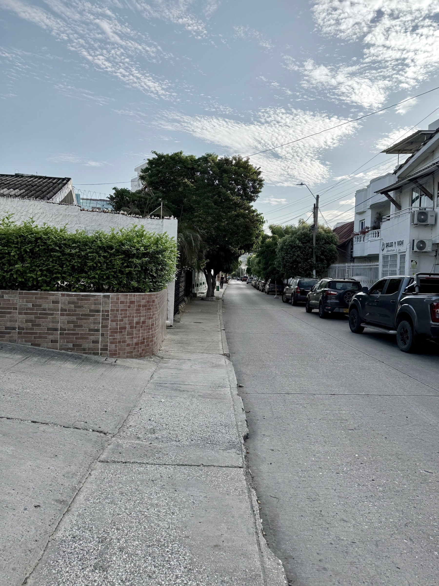

<figure>

</figure>

Hoy, como muchas mañanas, vamos con lo justo para llegar antes de las siete. Mi mano derecha sujeta su mano y con la izquierda llevo la lonchera mientras caminamos por ese andén irregular de siempre. Con la mirada al frente Elena me dice:

—Papi, hay niños que se van solos para el colegio.  
—Sí, pero son de bachillerato, como tu hermano Nico —le respondo en automático.

Gira la cabeza, me mira a los ojos.

—No, niños de primaria.  
—Tal vez vivan muy cerca del colegio —le digo después de unos segundos, frunciendo el ceño.  
—No —insiste—. Hay unos que viven más lejos. Eso debe ser ilegal.  
—Bueno, hasta allá no creo —le digo mientras cruzamos la calle—. Pero lo cierto es que a mí me gusta acompañarte todas las mañanas. Disfruto conversar contigo.  
—Y a mí también —me dice, estirando una sonrisa y mirándome por el rabillo del ojo.

Una moto frena tarde y se va de largo por el paso de cebra.

Aceleramos el paso hacia el andén.

—Como eso que acaba de pasar. Por eso me acompañas.

Con el sobresalto en el cuerpo, le suelto la mano, le entrego su lonchera y le tiro un beso.

—Que tengas un buen día —le digo, como quien deja algo de sí en ese gesto.

Me devuelvo caminando. La misma calle y el mismo calor de las siete. Los mismos carros y el mismo andén, pero ya sin la lonchera en una mano ni la suya en la otra. Las palabras siguen resonando en mi cabeza y la imagen de la moto que frena y no frena.

En ese aire húmedo y cálido de la mañana, caminando deprisa para llegar antes de las siete, hablamos de cosas que parecen pequeñas. De quién puede ir solo al colegio, de una moto que frena y no frena, de por qué todavía la acompaño. Algún día Elena también irá sola. Por ahora, antes de las siete, todavía caminamos juntos.
